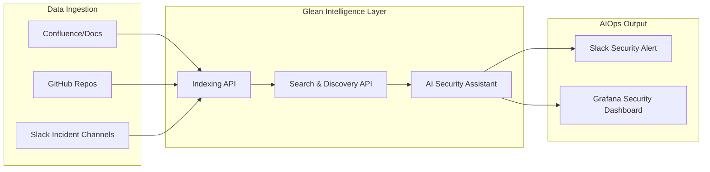

# Project: Glean-SEC — Enterprise Pipeline Sentry

Build a data analytics security platform that uses Glean-style knowledge discovery to find security risks across an entire enterprise ecosystem.

---

## 🏗️ Architecture: The Glean-SEC Pipeline

This project builds an end-to-end AIOps pipeline that monitors your high-value enterprise data analytics projects for security leaks, unauthorized access, and broken data lineage.



---

## 🎯 Project Tasks

### 1. The Multi-Source Ingestor (`ingestor.py`)
Collect "Knowledge Objects" (metadata, doc snippets, raw logs) from three different sources:
- **Filesystem** (mocking Confluence)
- **GitHub API** (mocking Git repos)
- **Slack Webhooks** (mocking chat history)

### 2. The Glean Discovery Logic (`glean_discovery.py`)
Implement the search logic to find:
- Hardcoded **API Keys** or Secrets in project documentation.
- **Unauthorized Data Access** mentions in Slack.
- **Old, Unmaintained Projects** that represent a security surface area.

### 3. Monitoring Dashboard (`dashboard.py`)
Build a 1-page monitoring dashboard that shows:
- **Total Searchable Knowledge Objects.**
- **High-Risk Security Flags.**
- **Incidents Correlated Across Apps.**

---

## 🏃 Running the Project

### 1. Requirements
Ensure you have the following installed:
```bash
pip install flask pandas matplotlib networkx
```

### 2. Execution
Run the end-to-end simulation:
```bash
cd src
python3 app.py
```

---

## 📂 File Structure
- `src/ingestor.py`: Enterprise data collection.
- `src/glean_discovery.py`: The knowledge core.
- `src/security_analyzer.py`: Risk scoring and alerting.
- `src/app.py`: Integrated Flask dashboard.
- `config/connections.json`: Sample configuration for data source connectors.
