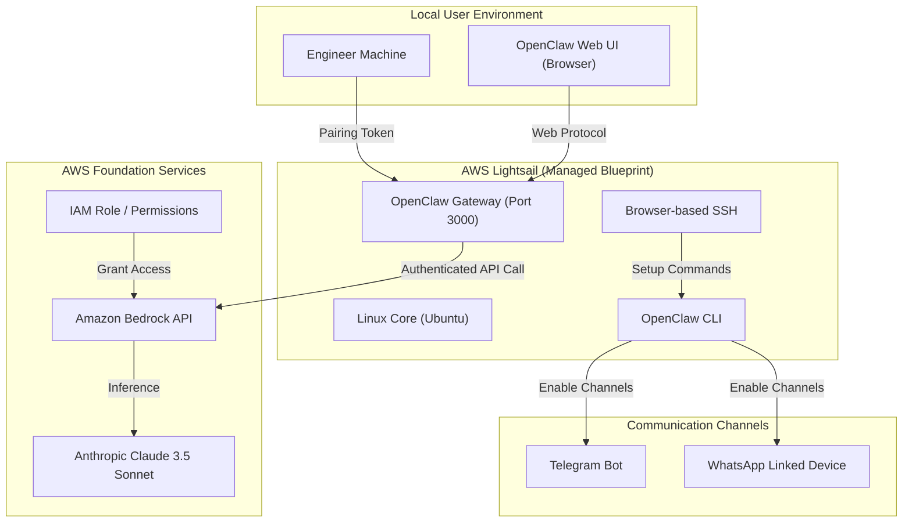
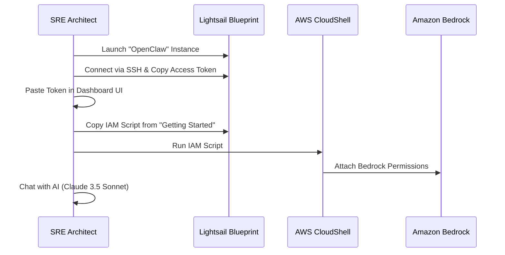
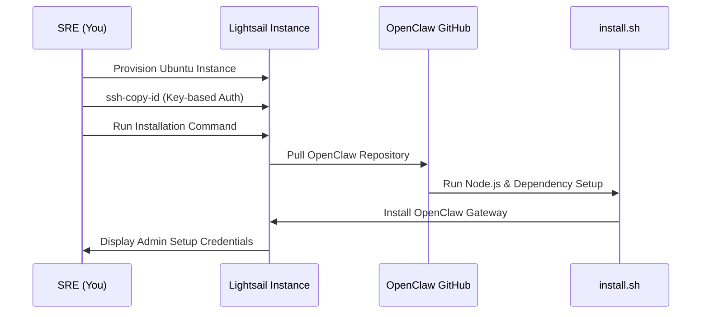

# Solution Architecture: OpenClaw on AWS Lightsail (Official Blueprint)

This document provides a technical blueprint based on the **Official AWS Lightsail OpenClaw Quick Start Guide**.

---

## 🏗️ 1. End-to-End Infrastructure Diagram

This diagram showcases the integration between the managed Lightsail blueprint and the Amazon Bedrock AI provider.

---

## ⚡ 2. The Official Deployment Flow

---

## 🛡️ 3. Security & Governance Layer

| Component | AWS Implementation | Purpose |
|-------|----------------|---------|
| **Compute** | Managed Blueprint | Hardened OS image provided by AWS. |
| **Identity** | IAM Role | Least-privilege access specifically for Bedrock. |
| **Access** | Browser Pairing | Secure session tokens ensure only the owner can use the bot. |
| **Network** | Lightsail Firewall | Default restrictive rules. |

---

## 📊 4. Key Performance Indicators (AIOps)

- **Bedrock Latency**: Time to first token for RCA summaries.
- **Pairing Health**: Verification of secure dashboard tunnel.
- **Channel Uptime**: Monitoring Telegram/WhatsApp bot connectivity.

---

  <a href="../../lecture-notes.md">⬅️ Back: Lecture Notes</a> | <a href="../../project/README.md">Next: Project ➡️</a>

---

## ⚡ 2. The Setup Workflow (Automation)

The installation process is streamlined to ensure idempotency and security.

---

## 🛡️ 3. Security Hardening Layer

To protect your cloud agent from brute-force attacks and unauthorized AI usage expenditures:

| Layer | Implementation | Purpose |
|-------|----------------|---------|
| **Transport** | SSH Tunneling | Access the UI via `localhost:3000` without opening public ports. |
| **Network** | Lightsail Firewall | Allow only Port 22 (SSH). Close all others by default. |
| **Auth** | Key-Based SSH | Disable password login to prevent brute force. |
| **App** | Token Management | Store API keys in encrypted `.env` files on the server. |

---

## 📊 4. Metrics & Monitoring Points

Once deployed, the AIOps engineer should monitor:
1.  **RAM Usage**: OpenClaw requires ~2GB base RAM. Lightsail's 4GB tier is recommended for high-volume logs.
2.  **Network Out**: Monitor data transfer to ensure the agent isn't stuck in a "Chatty Loop."
3.  **LLM Latency**: Track API response times from providers like Gemini vs. OpenAI.

---

  <a href="../../lecture-notes.md">⬅️ Back: Lecture Notes</a> | <a href="../../project/README.md">Next: Project ➡️</a>

