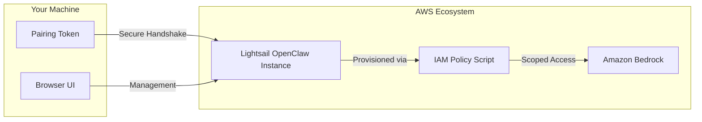

# Week 8 Day 2: Cloud-Hosted AI — AWS Lightsail & OpenClaw

> **Duration:** 8 hours | **Difficulty:** Intermediate
> **Theme:** Deploying persistent, cost-effective AI agents in the cloud.

---

## 🎯 Learning Objectives

By the end of this session, you will:
1.  **Understand OpenClaw Architecture:** A lightweight, community-driven AI agent suite.
2.  **Master AWS Lightsail:** Deploying Virtual Private Servers (VPS) for consistent, 24/7 AI workloads.
3.  **Secure Cloud Agents:** Configuring firewalls, SSH keys, and avoiding public exposure.
4.  **Integrate AIOps Channels:** Connecting your cloud agent to Slack or Discord for real-time monitoring.

---

## 📖 Lecture Content: The Rise of Cloud-Hosted AI Agents

### 1. What is OpenClaw?
OpenClaw is a cloud-native **AI Agent Platform** optimized for high-performance SRE and AIOps tasks. Unlike general-purpose LLMs, OpenClaw is designed to live on your infrastructure as a persistent "Cloud Architect."

- **Official AWS Integration**: AWS now provides a pre-configured **Blueprint** in Lightsail, ensuring the OS and dependencies (Node.js 22+) are tuned for agentic workloads.
- **Agentic Reasoning**: Uses the ReAct pattern to navigate complex troubleshooting trees.
- **Low Latency**: By running on the same network as your AWS resources, the agent can perform high-speed diagnostic lookups.

### 2. The Power of Amazon Bedrock
In this advanced setup, we move beyond public APIs and integrate directly with **Amazon Bedrock**:
- **Enterprise Privacy**: Your data stays within the AWS security boundary.
- **Claude 3.5 Sonnet**: The default brain for OpenClaw in Lightsail, offering state-of-the-art coding and reasoning capabilities.
- **IAM Governance**: Access is controlled via AWS Identity and Access Management (IAM) Roles, not just static API keys.

### 3. OpenClaw Setup Architecture (AWS Managed)

### 4. The 5-Phase Deployment Strategy
Following the official AWS Quick Start:
1.  **Blueprint Provisioning**: Selecting the managed "OpenClaw" image.
2.  **Browser Pairing**: Establishing a secure session between your device and the cloud gateway.
3.  **Model Activation**: Enabling Amazon Bedrock through a CloudShell IAM script.
4.  **Omnichannel Integration**: Linking Telegram or WhatsApp via the `openclaw` CLI.
5.  **Durable State**: Configuring automated snapshots for backup and recovery.

---

## 🛡️ Use Case: The Autonomous Bedrock Sentry
With Amazon Bedrock integration, your agent can analyze multi-source AWS data (CloudWatch, CloudTrail) with unparalleled speed.
- **Level 1**: Agent detects a 5xx spike in Lightsail metrics.
- **Level 2**: Agent calls Bedrock to compare the error spike with recent deployment timestamps.
- **Level 3**: Agent sends a RCA summary to your phone via WhatsApp and offers to roll back the instance.

---

## ✅ Deliverables for Today

- [ ] A functioning Blueprinted OpenClaw instance on AWS Lightsail.
- [ ] Successful browser pairing verified by the "OK" status.
- [ ] Amazon Bedrock integration enabled via the IAM CloudShell script.
- [ ] A verified chat session with Claude 3.5 Sonnet via the OpenClaw dashboard.

---

  <a href="../day-01-glean-analytics/lecture-notes.md">⬅️ Back: Day 1</a> | <strong>Day 2: AWS Lightsail & OpenClaw</strong> | <a href="../day-03-capstone-build/lecture-notes.md">Next: Day 3 ➡️</a>

