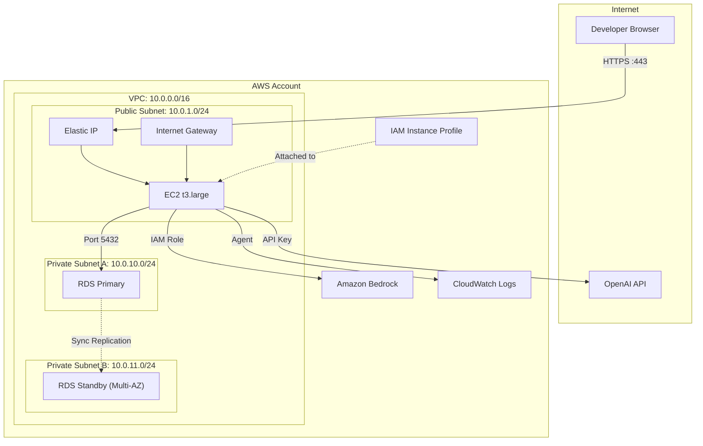
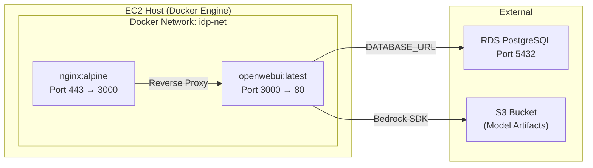
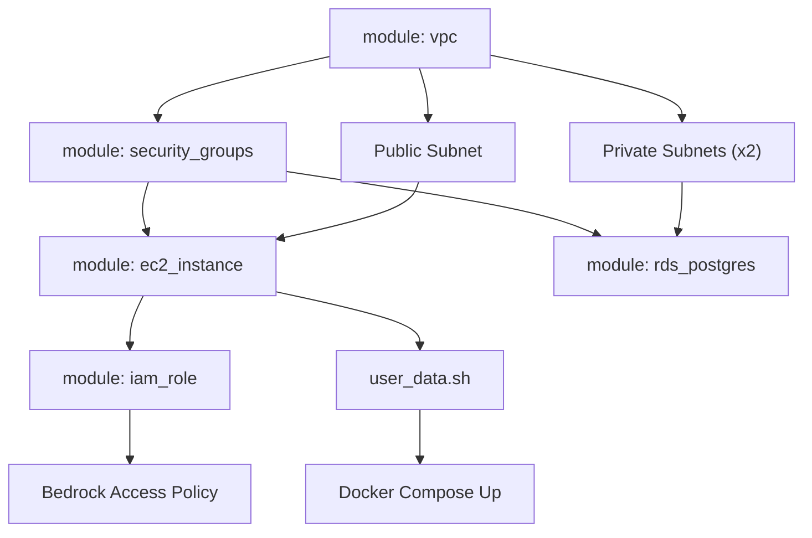
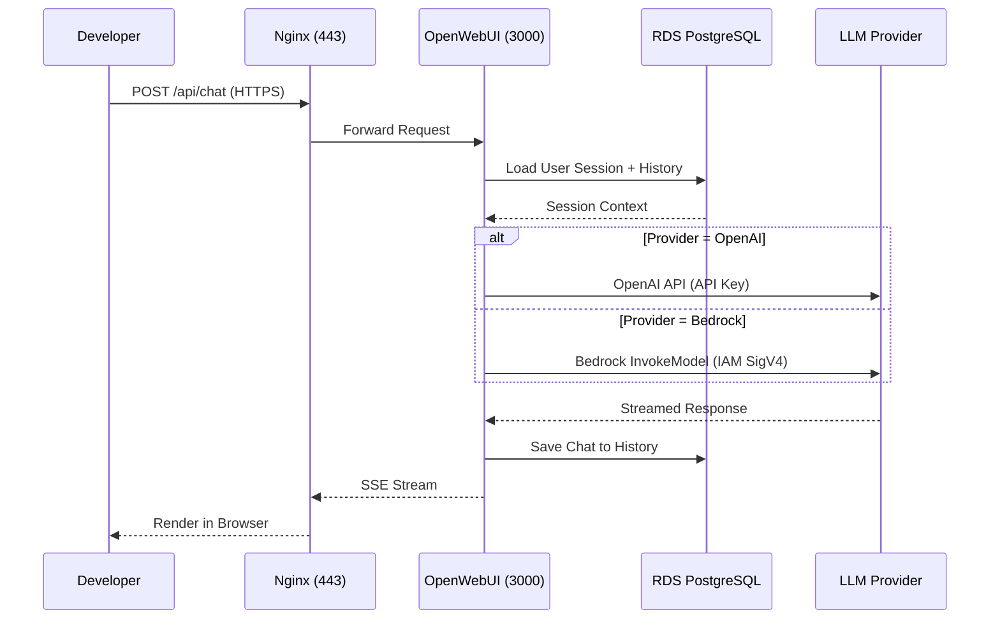

# Solution Architecture: IDP Platform (OpenWebUI + AWS)

Detailed architectural diagrams for the Internal Developer Platform capstone project.

---

## 🏗️ 1. Full Infrastructure Topology

---

## ⚡ 2. Container Architecture on EC2

---

## 🔐 3. Terraform Module Dependency Graph

---

## 🔄 4. End-to-End Request Flow

---

## 📋 5. Security Posture Summary

| Layer | Control | Implementation |
|-------|---------|----------------|
| **Network** | VPC Isolation | RDS in private subnet, no public IP |
| **Compute** | Security Group | Only ports 22, 80, 443 open on EC2 |
| **Database** | Network ACL | Port 5432 allowed only from EC2 SG |
| **Identity** | IAM Role | Instance Profile with scoped Bedrock policy |
| **Data** | Encryption at Rest | RDS with KMS encryption enabled |
| **Transport** | TLS | Nginx terminates HTTPS with Let's Encrypt or self-signed cert |
| **Application** | Auth | OpenWebUI built-in user authentication |

---

  <a href="../../lecture-notes.md">⬅️ Back: Lecture Notes</a> | <a href="../../project/README.md">Next: Project Guide ➡️</a>

