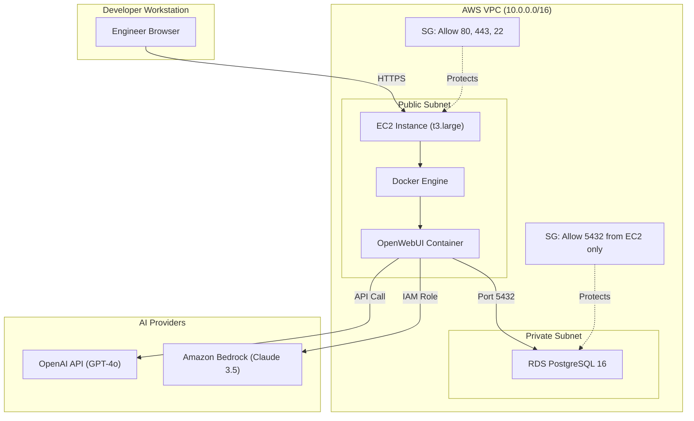

# Week 8 Day 3: Capstone — Internal Developer Platform (IDP)

> **Duration:** 8 hours | **Difficulty:** Advanced  
> **Theme:** Building a production-grade AI-powered Internal Developer Platform on AWS

---

## 🎯 Learning Objectives

By the end of this session, you will:
1. **Design an IDP Architecture** using OpenWebUI as the AI interface layer.
2. **Integrate Multiple LLM Providers** — OpenAI (GPT-4) and Amazon Bedrock (Claude) side-by-side.
3. **Provision Infrastructure as Code** using Terraform (VPC, EC2, RDS, Security Groups).
4. **Containerize & Deploy** the platform using Docker Compose on an EC2 instance.
5. **Configure a Managed Database** using Amazon RDS (PostgreSQL) for persistent chat history and user management.

---

## 📖 Lecture Content

### 1. What is an Internal Developer Platform (IDP)?
An IDP is a self-service layer that abstracts infrastructure complexity and provides developers with standardized tools, workflows, and AI-powered assistance.

**Why build one for AIOps?**
- Centralizes AI access (no more individual API keys per developer).
- Enforces security policies (all LLM traffic is routed through a governed gateway).
- Provides a unified chat interface for incident response, code review, and documentation.

### 2. The Technology Stack

| Layer | Technology | Purpose |
|-------|-----------|---------|
| **UI** | OpenWebUI | Beautiful, extensible chat interface |
| **LLM (Public)** | OpenAI GPT-4o | General-purpose reasoning |
| **LLM (Private)** | Amazon Bedrock (Claude 3.5) | Enterprise-grade, data-private inference |
| **Compute** | AWS EC2 (t3.large) | Docker host for application containers |
| **Database** | Amazon RDS (PostgreSQL 16) | Persistent storage for users, chats, settings |
| **Networking** | AWS VPC + Security Groups | Network isolation and least-privilege access |
| **IaC** | Terraform | Reproducible, version-controlled infrastructure |

### 3. Solution Architecture

### 4. Why Dual LLM Providers?
- **OpenAI (GPT-4o)**: Best for general coding, creative tasks, and broad knowledge. Uses API key authentication.
- **Bedrock (Claude 3.5 Sonnet)**: Best for sensitive enterprise data. Traffic never leaves AWS. Uses IAM Role authentication (no API key needed on the instance).

---

## 🛠️ Deployment Phases

| Phase | Task | Tool |
|-------|------|------|
| 1 | Provision VPC, Subnets, Security Groups | Terraform |
| 2 | Launch EC2 instance with Docker | Terraform + User Data Script |
| 3 | Deploy RDS PostgreSQL in Private Subnet | Terraform |
| 4 | Configure & Launch OpenWebUI Container | Docker Compose |
| 5 | Connect OpenAI + Bedrock Providers | OpenWebUI Admin Panel |
| 6 | Verify End-to-End Chat & Persistence | Browser Testing |

---

## ✅ Deliverables

- [ ] A fully provisioned AWS environment via `terraform apply`.
- [ ] A running OpenWebUI instance accessible via the EC2 public IP.
- [ ] Dual LLM providers configured (OpenAI + Bedrock).
- [ ] Chat history persisted in RDS PostgreSQL across restarts.
- [ ] A documented Mermaid architecture diagram.

---

## 📚 Deep Dive Resources

- 👉 [Solution Architecture Diagrams](docs/diagrams/SOLUTION_ARCHITECTURE.md)
- 👉 [Step-by-Step Setup Guide](project/README.md)
- 👉 [Reference Links & Resources](resources/RESOURCES.md)

---

  <a href="../day-02-openclaw-aws/lecture-notes.md">⬅️ Back: Day 2</a> | <strong>Day 3: IDP Capstone</strong> | <a href="../day-04-documentation/lecture-notes.md">Next: Day 4 ➡️</a>

