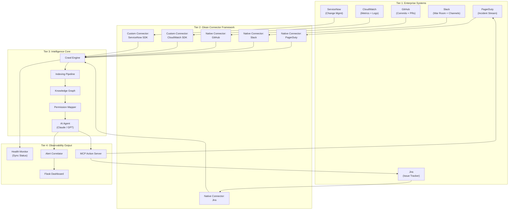
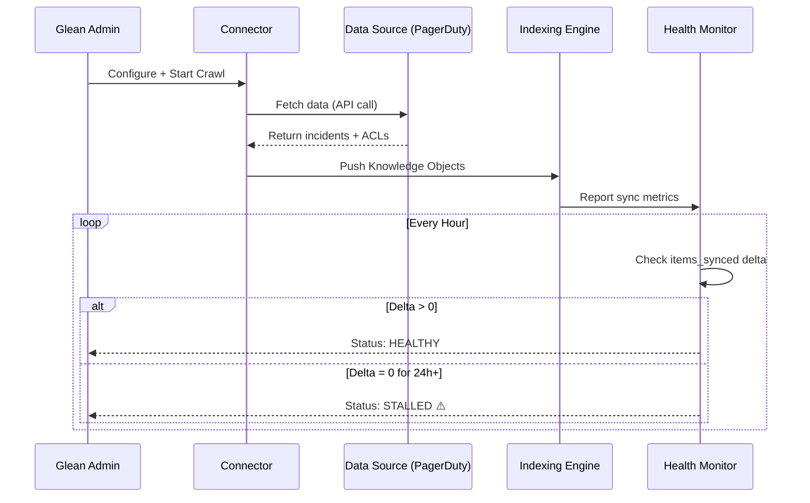
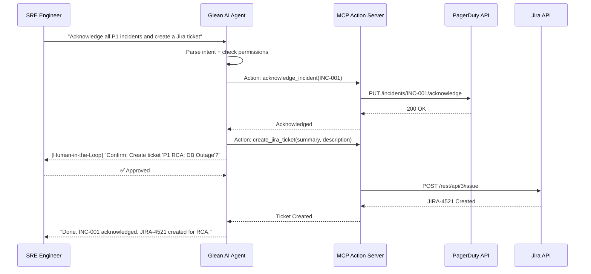
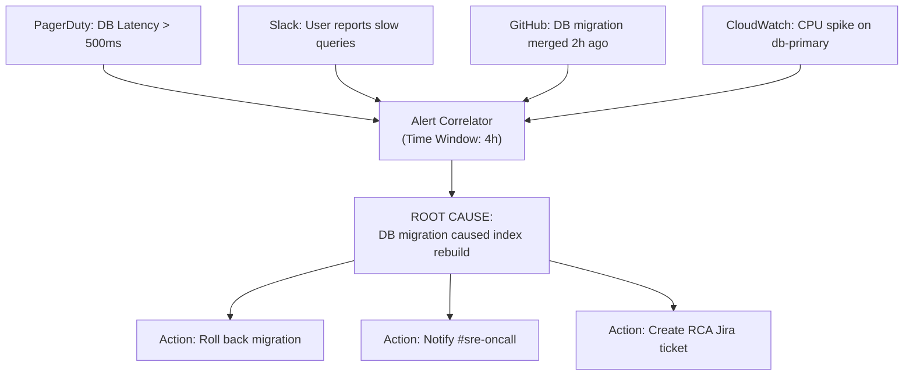
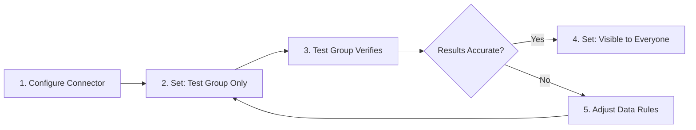

# Solution Architecture: Enterprise Observability Hub

Comprehensive diagrams for the Glean-powered observability, monitoring, logging, and alerting solution.

---

## 🏗️ 1. Full Observability Topology

---

## ⚡ 2. Connector Sync & Monitoring Pipeline

---

## 🔐 3. MCP Action Flow (Read → Write → Execute)

---

## 📊 4. Alert Correlation Logic

---

## 🔄 5. Data Source Visibility Rollout

---

## 📋 6. Security & Governance Matrix

| Layer | Control | Detail |
|-------|---------|--------|
| **Connector Auth** | OAuth 2.0 / API Token | Per-source authentication |
| **Permission Sync** | ACL Inheritance | Respect source permissions in search results |
| **Visibility** | Test Group → All | Staged rollout of new data sources |
| **MCP Actions** | Human-in-the-Loop | All write/execute actions require user confirmation |
| **Data Rules** | Include/Exclude | Filter channels, repos, ticket types |
| **Audit** | Action Logging | All MCP actions logged with user ID and timestamp |

---

  <a href="../../lecture-notes.md">⬅️ Back: Lecture Notes</a> | <a href="../../project/README.md">Next: Project Guide ➡️</a>

