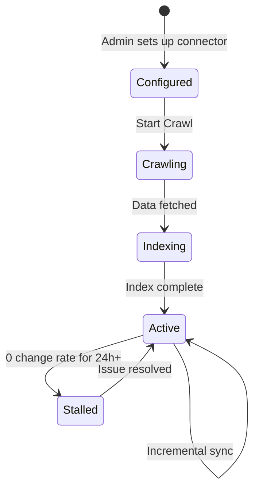
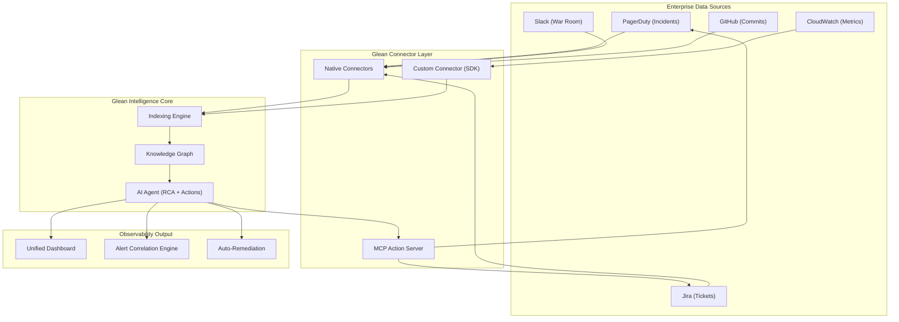

# Week 8 Day 4: Enterprise Observability with Glean Connectors

> **Duration:** 8 hours | **Difficulty:** Advanced  
> **Theme:** Building a unified observability, monitoring, logging, and alerting pipeline using Glean's Connector ecosystem.

---

## 🎯 Learning Objectives

By the end of this session, you will:
1. **Understand Glean Connectors** — What they are, how they crawl enterprise data, and how to manage them.
2. **Design Observability Pipelines** — Using connectors to unify logs, metrics, and incident context from PagerDuty, Slack, Jira, and GitHub.
3. **Configure MCP-backed Actions** — Enabling read/write/execute operations from Glean Agents into external systems.
4. **Monitor Data Sources** — Understanding sync status, change rates, troubleshooting stalls, and visibility controls.
5. **Build a Capstone** — A complete Glean-style Observability Hub with multi-source ingestion, alerting rules, and an MCP action server.

---

## 📖 Lecture Content

### 1. What Are Glean Connectors?

Glean Connectors are **bridges** between enterprise applications and the Glean intelligence layer. They crawl, index, and synchronize data from 100+ sources (Slack, Jira, PagerDuty, GitHub, Confluence, ServiceNow, etc.) into a unified knowledge graph.

**Key Properties:**
- **Native Connectors**: Pre-built integrations (e.g., PagerDuty, Slack, Jira) with automatic schema mapping.
- **Custom Connectors**: Build your own using the Glean SDK for proprietary systems.
- **Permission Inheritance**: Connectors inherit the source's ACLs — a user only sees what they are authorized to see in the original app.

### 2. Managing & Monitoring Connectors

Based on the [Glean Connector Monitoring Documentation](https://docs.glean.com/connectors/monitoring):

#### Sync Status Lifecycle

#### Key Metrics to Monitor
| Metric | Healthy | Warning | Critical |
|--------|---------|---------|----------|
| **Items Synced** | Increasing over time | Flat for 12h | Flat for 24h+ |
| **Change Rate (items/day)** | > 0 (if activity expected) | 0 for 48h | 0 for 7 days |
| **Crawl Status** | Active / Indexing | Stalled | Error |

#### Best Practices (from Glean Docs)
- During onboarding, monitor the **Initial sync in progress** section.
- In steady state, monitor **Change rate (items/day)** to ensure day-to-day updates are flowing.
- Investigate sustained 0 values when activity is expected (misconfiguration, API throttling).
- Start new data sources with **"Visible to test group only"** before rolling out to everyone.

### 3. Configuring Actions via MCP

Based on the [Glean MCP Actions Guide](https://docs.glean.com/connectors/configure-actions-in-datasource/config-actions-mcp-from-datasource):

**MCP Actions** allow Glean Agents to **read, write, and execute** tasks against external systems:

#### Core Capabilities
- **Read**: Pull data from monitoring tools (e.g., fetch latest PagerDuty incidents).
- **Write**: Push updates back (e.g., acknowledge an alert, close a Jira ticket).
- **Execute**: Trigger custom remediation scripts via the MCP server.
- **Human-in-the-loop**: All actions include confirmation before execution.

#### Step-by-Step MCP Setup
1. Navigate to **Admin Console** → Edit Data Source.
2. Select the **Actions (optional)** tab.
3. Choose **Native action pack** (pre-configured) or **MCP server-backed actions** (custom tools).
4. Complete authentication (OAuth, API Key, or Token).
5. Save and verify the configuration.

### 4. Solution Architecture: Observability Hub

### 5. Visibility Controls

When adding new data sources, Glean enforces a staged rollout:
1. **Step 1**: Set visibility to **"Visible to test group only"**.
2. **Step 2**: Configure your test group via [Manage test group](https://app.glean.com/admin/setup/apps/testing).
3. **Step 3**: Verify search results and content accuracy with the test group.
4. **Step 4**: Set visibility to **"Visible to everyone"**.

### 6. Advanced Configuration: Data Rules

Control what gets indexed:
- **Inclusion Rules**: Only crawl specific channels (e.g., `#production-*` in Slack).
- **Exclusion Rules**: Skip sensitive channels (e.g., `#hr-confidential`).
- **Content Type Filters**: Index only specific document types (e.g., Folders, Documents — not Videos).
- **Crawling Parameters**: Set crawl frequency and depth.

---

## ✅ Deliverables

- [ ] A complete Observability Hub architecture with Mermaid diagrams.
- [ ] A working multi-source connector simulator (PagerDuty, Slack, Jira, CloudWatch).
- [ ] A connector health monitoring dashboard with sync status tracking.
- [ ] An MCP Action Server that can acknowledge PagerDuty incidents and create Jira tickets.
- [ ] An alert correlation engine that links signals across sources.

---

## 📚 Deep Dive Resources

- 👉 [Solution Architecture Diagrams](docs/diagrams/SOLUTION_ARCHITECTURE.md)
- 👉 [Step-by-Step Project Guide](project/README.md)
- 👉 [Reference Links & Resources](resources/RESOURCES.md)

---

  <a href="../day-03-idp-platform/lecture-notes.md">⬅️ Back: Day 3</a> | <strong>Day 4: Enterprise Observability</strong> | <a href="../day-05-documentation/lecture-notes.md">Next: Day 5 ➡️</a>

