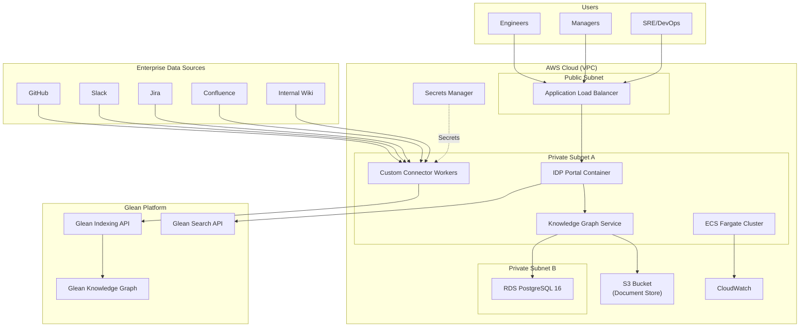
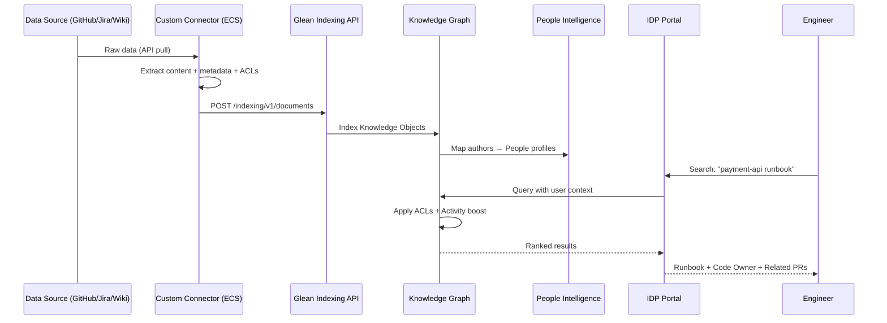
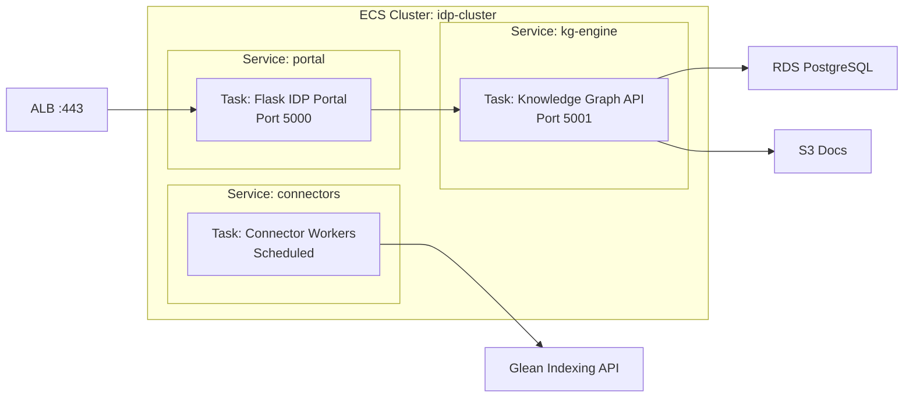
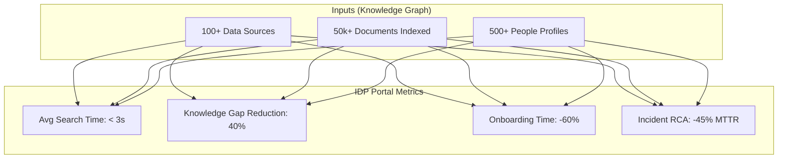

# Solution Architecture: Knowledge Graph IDP on AWS

---

## 🏗️ 1. Full AWS Infrastructure Topology

---

## ⚡ 2. Knowledge Graph Data Flow

---

## 🧠 3. Knowledge Graph Pillar Architecture

```mermaid
graph TD
    subgraph "Pillar 1: Content Integration"
        C1["Full Content Analysis"]
        C2["Metadata Extraction"]
        C3["Permission Sync"]
        C4["Faceted Search"]
    end

    subgraph "Pillar 2: People Intelligence"
        P1["Unified Identity"]
        P2["Org Chart Mapping"]
        P3["Expertise Tagging"]
        P4["Collaboration Graph"]
    end

    subgraph "Pillar 3: Activity Tracking"
        A1["View History"]
        A2["Search Patterns"]
        A3["Click Signals"]
        A4["Knowledge Gaps"]
    end

    subgraph "Pillar 4: Collective Intelligence"
        I1["Trending Content"]
        I2["Popular Resources"]
        I3["Team Recommendations"]
        I4["Organic Boosting"]
    end

    KG["Knowledge Graph Core"]
    KG --> C1 & C2 & C3 & C4
    KG --> P1 & P2 & P3 & P4
    KG --> A1 & A2 & A3 & A4
    KG --> I1 & I2 & I3 & I4
```

---

## 🐳 4. ECS Fargate Service Architecture

---

## 🔐 5. Security & Governance

| Layer | AWS Service | Purpose |
|-------|------------|---------|
| **Network** | VPC + Private Subnets | Portal and DB in isolated network |
| **Compute** | ECS Fargate | Serverless containers, no EC2 to patch |
| **Identity** | IAM Roles | Task-level scoped permissions |
| **Secrets** | Secrets Manager | API keys, DB passwords |
| **Data** | RDS Encryption + S3 SSE | Encryption at rest (KMS) |
| **Transport** | ALB + ACM | TLS termination with AWS Certificate Manager |
| **Access** | Knowledge Graph ACLs | Source-inherited permissions on every query |
| **Audit** | CloudWatch + CloudTrail | Full request and access audit trail |

---

## 📊 6. IDP Value Metrics

---

  <a href="../../lecture-notes.md">⬅️ Back: Lecture Notes</a> | <a href="../../project/README.md">Next: Project Guide ➡️</a>

