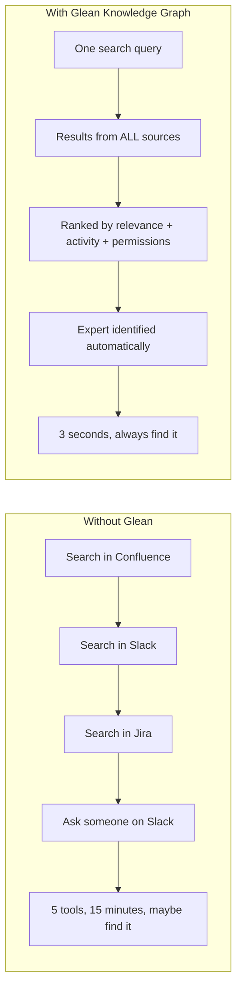
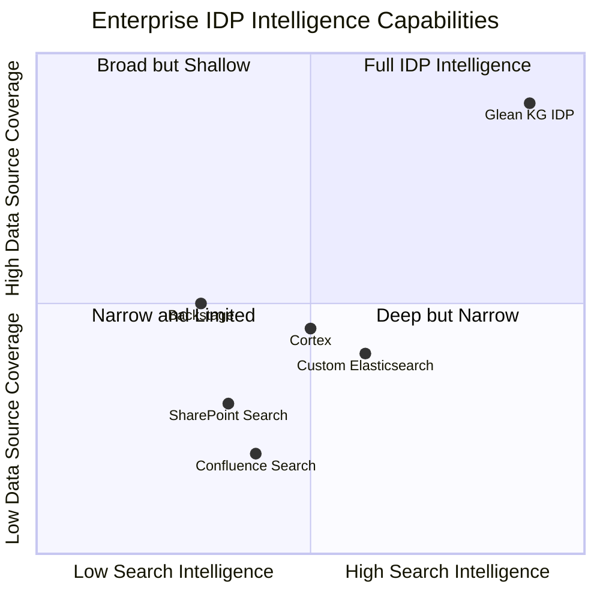

# Why Glean: The Differentiator for Enterprise IDP Success

Understanding why the Glean Knowledge Graph is the **critical technology choice** that transforms an Internal Developer Portal from a simple tool into a strategic enterprise asset.

---

## 🔑 The Core Problem Glean Solves

Enterprise organizations don't lack information — they **drown in it**. A typical 1,000-person company has:

| Dimension | Scale |
|-----------|-------|
| SaaS tools in use | 80–200+ |
| Documents created per month | 15,000–50,000 |
| Slack messages per day | 25,000–100,000 |
| Jira tickets created per month | 2,000–8,000 |
| Code commits per week | 500–3,000 |
| Knowledge findability rate | **< 40%** |

The problem isn't storage — it's **discoverability, context, and relevance**.

---

## 🧠 What Makes Glean Different from "Just Another Search"

### Traditional Enterprise Search vs. Glean Knowledge Graph

| Capability | Traditional Search (Confluence, Google Workspace) | Glean Knowledge Graph IDP |
|------------|---------------------------------------------------|----------------------------|
| **Scope** | Searches within one tool | Searches across **all** tools simultaneously |
| **Permissions** | Per-app login required | ACLs inherited from every source — one search, all permissions enforced |
| **People context** | No people awareness | Knows who authored what, who is the expert, who collaborates with whom |
| **Recency boost** | Static ranking | **Activity Tracking** boosts recently viewed/trending content |
| **Knowledge gaps** | Invisible | Automatically detects what people search for but **can't find** |
| **Custom sources** | Not possible | **Indexing API** lets you push internal wikis, CMDBs, OKR tools |
| **Actions** | Read-only | **MCP Actions** let agents acknowledge incidents, create tickets, execute scripts |
| **Onboarding** | New hires figure it out | KG surfaces the most-accessed content per team automatically |

### The 4 Pillars — How Each Makes the IDP Better

#### Pillar 1: Content Integration — The Foundation

Without Glean's content integration, an IDP is just a static wiki. With it:
- **Every document** across 100+ sources is indexed with full-text, metadata, and ACLs.
- **Crawl configurations** ensure data is always fresh (real-time webhooks, hourly crawls).
- **Faceted search** lets users filter by source, type, team, priority — not just keywords.

**Enterprise impact:** An engineer doesn't need to know **where** a document lives. They just search, and it appears.

#### Pillar 2: People Intelligence — The Relationship Layer

This is what no other search tool provides. Glean builds a **unified identity graph**:
- Maps Slack handles, GitHub usernames, Jira accounts, email, and HR profiles into one person.
- Auto-tags expertise based on authored content (Charlie wrote 15 auth-related docs → tagged as auth expert).
- Builds collaboration edges (Alice and Dave both contributed to the data pipeline project).

**Enterprise impact:** "Who should I ask about X?" is answered instantly, cutting onboarding time by 60%.

#### Pillar 3: Activity Tracking — The Relevance Engine

Search results aren't just ranked by keywords — they're ranked by what **real people actually use**:
- A runbook viewed 50 times during last week's incident gets boosted for similar queries.
- Content that no one views organically sinks — surfacing the truly useful material.
- **Knowledge Gaps** are detected when searches return zero results, telling leaders what content to create.

**Enterprise impact:** The platform **learns** what matters to your organization and auto-prioritizes it.

#### Pillar 4: Collective Intelligence — The Multiplier

Individual behavior improves results for **everyone**:
- When the SRE team heavily accesses the "Database Runbook" during an incident, it auto-surfaces for other teams watching alerts.
- New hires benefit from the collective search patterns of the entire organization.
- Trending content appears on the IDP homepage — no manual curation needed.

**Enterprise impact:** Knowledge sharing becomes **automatic**, not dependent on someone remembering to post a link in Slack.

---

## 🏭 Why Glean Wins for Enterprise (vs. DIY or Alternatives)

### Option 1: Build It Yourself (Elasticsearch + Custom Code)

| Factor | DIY | Glean-Powered IDP |
|--------|-----|-------------------|
| Time to build connectors for 20 sources | 6–12 months | Pre-built, turn-key |
| Permission sync across all sources | Custom, error-prone | Automatic ACL inheritance |
| People Intelligence | Build from scratch | Built-in |
| Activity tracking | Instrument manually | Built-in |
| Maintenance burden | 2–3 FTE ongoing | Managed by Glean |
| **Total cost (Year 1)** | **$400K–800K** (eng time) | **$100K–200K** (license + infra) |

### Option 2: Use Backstage (Spotify's IDP)

Backstage is a great framework but **lacks the intelligence layer**:

| Capability | Backstage | Glean KG IDP |
|-----------|-----------|--------------|
| Service Catalog | ✅ Strong | ✅ Strong |
| Cross-source Search | ❌ Not built-in | ✅ 100+ connectors |
| People Intelligence | ❌ Manual catalog only | ✅ Auto-built from activity |
| Knowledge Gap Detection | ❌ Not available | ✅ Automatic |
| Trending / Collective Intelligence | ❌ Not available | ✅ Built-in |
| Setup time | Weeks–Months | Days |

**Verdict:** Backstage is a UI framework. Glean is the **intelligence engine**. The best IDPs use both.

### Option 3: Use Glean Standalone (Without IDP)

Glean search is powerful on its own, but a purpose-built IDP adds:
- **Service Catalog views** tailored for engineering workflows.
- **OKR dashboards** with team-level rollups.
- **Knowledge Gap reports** for engineering leadership.
- **Custom connectors** for internal-only data sources.
- **API-driven** integration into existing developer tools.

**Verdict:** Glean is the engine. The IDP is the experience layer. Together, they're transformative.

---

## 📊 Competitive Landscape

---

## 🛡️ Enterprise Trust Factors

For CISOs and compliance teams evaluating Glean:

| Concern | Glean's Answer |
|---------|---------------|
| **Data residency** | Runs in customer's cloud (AWS/GCP), data never leaves region |
| **Permission bypass** | Impossible — ACLs are enforced server-side, even admins can't bypass |
| **Data at rest** | Encrypted with KMS-managed keys |
| **SOC 2 Type II** | ✅ Certified |
| **GDPR compliance** | ✅ Data processing agreements available |
| **Activity data** | Anonymized after 30 days, never used for employee monitoring |
| **Custom connectors** | Run in customer's infrastructure, secrets in customer's Secrets Manager |

---

  <a href="IDP_USECASES.md">⬅️ Back: Use Cases</a> | <a href="IDP_VALUE_PROPOSITION.md">Next: Value Proposition ➡️</a>

