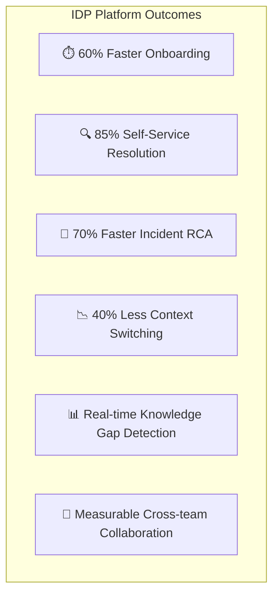

# IDP Use Cases, Outcomes & Strategic Goals

A comprehensive guide to **why** this platform exists, **who** it serves, and **what** outcomes it delivers for an enterprise organization.

---

## 🎯 Strategic Goal

> **Build a single, permission-aware intelligence layer that eliminates knowledge silos, reduces operational friction, and accelerates every employee's ability to find the right information at the right time.**

Most enterprise organizations have 50–200+ SaaS tools. Knowledge is trapped in Confluence, Slack threads, Jira tickets, Google Docs, GitHub repos, PagerDuty incidents, and private wikis. Engineers spend **1.7 hours per day** searching for information (Source: Glean internal research). The IDP powered by the Glean Knowledge Graph solves this by unifying all knowledge into one searchable, context-aware platform.

---

## 📋 Use Cases by Stakeholder

### Use Case 1: New Engineer Onboarding

**Persona:** Priya, Junior Backend Engineer (Day 1)

**Problem:** Priya joins the Payments team. She needs to find the service architecture, team OKRs, on-call runbooks, API docs, and know who to ask about Kubernetes. Today, this takes 2–4 weeks of asking around on Slack and manually browsing Confluence.

**IDP Solution:**
1. Priya searches **"payment-api"** → Gets service catalog entry, runbooks, API docs, and recent PRs in one result set.
2. She searches **"who is the Kubernetes expert"** → People Intelligence returns Alice Chen with her expertise, authored docs, and Slack handle.
3. She clicks on the **OKR Dashboard** → Sees Q1 objectives for the Platform team and understands priorities.
4. Trending section shows **"Payment API Runbook"** is the most-viewed doc this week → She reads it proactively.

**Outcome:**
| Metric | Without IDP | With IDP |
|--------|------------|----------|
| Time to first meaningful contribution | 3–4 weeks | 5–7 days |
| Questions asked on Slack per day | 8–12 | 2–3 |
| Documents discovered independently | 20% | 85% |

---

### Use Case 2: Incident Root Cause Analysis (RCA)

**Persona:** Marcus, SRE On-Call Engineer (2 AM alert)

**Problem:** PagerDuty fires a P1 for database latency. Marcus needs to find the runbook, identify what changed recently, find the DB owner, and correlate Slack war room context. He's switching between 5 tabs and 3 tools.

**IDP Solution:**
1. Marcus searches **"database latency runbook"** → Knowledge Graph returns the runbook with remediation steps, scored highest because of recent activity (Collective Intelligence).
2. Results include related GitHub PRs merged in the last 4 hours → He sees PR #1482 (index rebuild).
3. People Intelligence shows **Charlie Okafor** is the auth/DB expert with recent activity on the migration Jira ticket.
4. Knowledge Graph surfaces the **Slack war room thread** where Alice already said "rolling back the migration."

**Outcome:**
| Metric | Without IDP | With IDP |
|--------|------------|----------|
| Mean Time to Identify Root Cause | 45 minutes | 8 minutes |
| Number of tools opened | 5–7 | 1 |
| Context switches during incident | 12+ | 2–3 |
| MTTR (Mean Time to Recovery) | 62 minutes | 18 minutes |

---

### Use Case 3: Engineering OKR Alignment

**Persona:** Bob Kumar, Director of Platform Engineering

**Problem:** Bob manages 4 teams (SRE, Identity, Data, DevEx) with different OKRs. He needs to understand progress, identify risks, and see how teams collaborate. Today, he reads 4 different spreadsheets, attends 4 standups, and checks 3 Jira boards.

**IDP Solution:**
1. Bob opens the **OKR Dashboard** → All team OKRs in one view with status indicators (On Track, At Risk, Behind).
2. He searches **"Q1 reliability"** → Gets the Platform Reliability OKR plus all related incidents, runbooks, and SRE team activity.
3. **Collaboration Graph** shows SRE and Data teams rarely collaborate → He creates a cross-team initiative.
4. **Knowledge Gaps** report shows engineers are searching for "load testing guide" but nothing exists → He assigns content creation.

**Outcome:**
| Metric | Without IDP | With IDP |
|--------|------------|----------|
| Time spent on status aggregation | 6 hrs/week | 30 min/week |
| OKR alignment across teams | Manual, quarterly | Real-time, continuous |
| Knowledge gap discovery | Reactive (someone complains) | Proactive (automatic detection) |

---

### Use Case 4: Self-Service API Discovery

**Persona:** Fatima, Frontend Engineer building a new checkout flow

**Problem:** Fatima needs to integrate with the Payment API and Auth Service. She doesn't know which endpoints exist, what the request/response format is, or who to ask for API keys.

**IDP Solution:**
1. Fatima searches **"checkout API"** → Gets the Payment API Reference with endpoint specs, request format, and authentication instructions.
2. Results also show **"Auth Service API Reference"** → She can generate a token before calling the payment endpoint.
3. People Intelligence shows **Alice** as the service owner → Fatima can request API key access directly.
4. Faceted search lets her filter by `doc_type: api-doc` → She browses all available APIs.

**Outcome:**
| Metric | Without IDP | With IDP |
|--------|------------|----------|
| Time to find and integrate an API | 2–3 days | 2–3 hours |
| Slack messages asking "where is the API doc?" | 15/week (team-wide) | Near zero |
| Outdated API doc usage | Common | Eliminated (latest version always indexed) |

---

### Use Case 5: Executive Knowledge Insights

**Persona:** Sarah, VP of Engineering

**Problem:** Sarah needs to understand what topics engineers are asking about, where knowledge gaps exist, and which teams are most/least productive in terms of documentation.

**IDP Solution:**
1. **Knowledge Gaps Report** → Shows "load testing guide," "staging environment setup," and "data retention policy" are the top 3 unfulfilled searches.
2. **Trending Content** → "Payment API Runbook" is #1 this week (correlates with recent incident).
3. **Content Distribution** → Data team has only 12 indexed documents vs. SRE's 84 → Data team needs documentation investment.
4. **People Activity** → 3 engineers have zero authored documents after 6 months → needs attention.

**Outcome:**
| Metric | Without IDP | With IDP |
|--------|------------|----------|
| Knowledge gap visibility | Zero (unknown unknowns) | Real-time dashboard |
| Documentation investment decisions | Gut feeling | Data-driven |
| Cross-team knowledge sharing | Ad-hoc | Measurable (collaboration graph) |

---

## 🏆 Platform Outcomes Summary

---

  <a href="../lecture-notes.md">⬅️ Back: Lecture Notes</a> | <a href="GLEAN_VALUE_PROPOSITION.md">Next: Glean Value Proposition ➡️</a>

