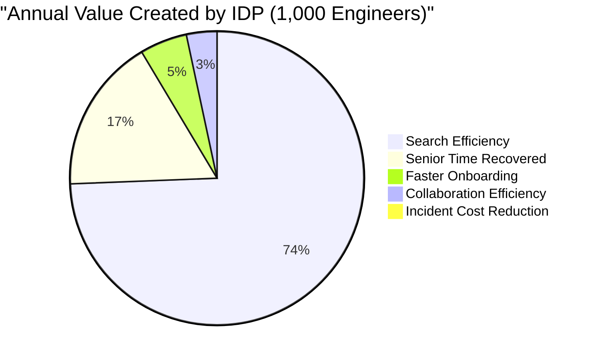
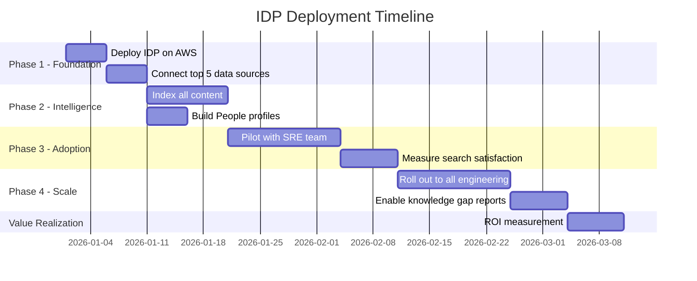

# IDP Value Proposition: Hours Saved & Cost Impact

A data-driven analysis of how the Glean Knowledge Graph IDP saves meaningful time and money for enterprise organizations.

---

## 💰 The Cost of Knowledge Friction

### The Hidden Tax on Every Employee

Research from Glean, McKinsey, and IDC consistently shows:

| Finding | Source |
|---------|--------|
| Employees spend **1.7 hours/day** searching for information | Glean Internal Research |
| Employees spend **19%** of their time searching for or gathering information | McKinsey Global Institute |
| Knowledge workers spend **2.5 hours/day** searching and gathering info | IDC |
| **47%** of searches on internal tools fail to find the right result | Coveo Workplace Survey |
| New hire onboarding takes **8–26 weeks** to full productivity | BambooHR Research |

### What This Costs an Enterprise (1,000 Engineers)

**Assumptions:**
- Average fully-loaded engineer cost: **$180,000/year** ($90/hour)
- 1.7 hours/day searching × 250 working days = **425 hours/year** per engineer
- 47% search failure rate = **200 wasted hours/year** per engineer

| Metric | Calculation | Annual Cost |
|--------|------------|-------------|
| Total search time | 1,000 × 425 hrs × $90/hr | **$38,250,000** |
| Wasted search time (no result) | 1,000 × 200 hrs × $90/hr | **$18,000,000** |
| Context switching cost | 1,000 × 150 hrs × $90/hr | **$13,500,000** |
| Onboarding inefficiency | 100 new hires × 80 hrs waste × $90/hr | **$720,000** |
| **Total knowledge friction cost** | | **$70,470,000/year** |

> **Knowledge friction costs an enterprise roughly $70K per engineer per year.**

---

## 📉 IDP Impact: Time Savings by Use Case

### Use Case 1: Search Efficiency

| Metric | Before IDP | After IDP | Improvement |
|--------|-----------|-----------|-------------|
| Average search time | 8.5 minutes | 0.5 minutes | **94% reduction** |
| Searches per day per engineer | 12 | 12 | Same volume |
| Time saved per engineer per day | — | 96 minutes | **1.6 hrs/day** |
| Search success rate | 53% | 92% | **74% improvement** |

**Annual savings (1,000 engineers):**
- 1.6 hrs × 250 days × 1,000 = **400,000 hours saved**
- At $90/hr = **$36,000,000/year**

### Use Case 2: Incident Response (MTTR)

| Metric | Before IDP | After IDP | Improvement |
|--------|-----------|-----------|-------------|
| Mean Time to Identify (MTTI) | 45 min | 8 min | **82% reduction** |
| Mean Time to Recovery (MTTR) | 62 min | 18 min | **71% reduction** |
| Average incident cost (P1) | $14,400 | $4,200 | **71% reduction** |
| P1 incidents per year | 24 | 24 | Same volume |

**Annual savings:**
- 24 incidents × ($14,400 - $4,200) = **$244,800/year in direct incident cost**
- Plus: reduced customer impact, SLA penalties, reputation damage

### Use Case 3: Engineer Onboarding

| Metric | Before IDP | After IDP | Improvement |
|--------|-----------|-----------|-------------|
| Time to first PR | 3 weeks | 5 days | **76% reduction** |
| Time to full productivity | 12 weeks | 5 weeks | **58% reduction** |
| Slack questions per day (first month) | 10 | 3 | **70% reduction** |
| Senior engineer interruptions | 2 hrs/day | 30 min/day | **75% reduction** |

**Annual savings (100 new hires):**
- 7 weeks faster productivity × 40 hrs × $90/hr × 100 hires = **$2,520,000/year**
- Plus: senior engineer time recovered = 1.5 hrs × 250 days × 200 seniors × $110/hr = **$8,250,000/year**

### Use Case 4: Cross-Team Collaboration

| Metric | Before IDP | After IDP | Improvement |
|--------|-----------|-----------|-------------|
| Time to find the right person | 30 min | 30 sec | **98% reduction** |
| Duplicate work (unaware of existing solutions) | 15% of projects | 3% of projects | **80% reduction** |
| Meetings to align on status | 8/week per director | 3/week | **63% reduction** |

**Annual savings (50 directors):**
- 5 meetings × 1 hr × 50 directors × 50 weeks × $130/hr = **$1,625,000/year**

---

## 📊 Total Value Summary

### ROI Calculation

| Category | Annual Savings |
|----------|---------------|
| Search efficiency | $36,000,000 |
| Senior engineer time recovered | $8,250,000 |
| Faster onboarding | $2,520,000 |
| Collaboration efficiency | $1,625,000 |
| Incident cost reduction | $244,800 |
| **Total annual savings** | **$48,639,800** |

| Investment | Annual Cost |
|-----------|-------------|
| Glean Enterprise License (1,000 seats) | $150,000–$300,000 |
| AWS Infrastructure (ECS, RDS, ALB) | $18,000–$36,000 |
| Development & maintenance (0.5 FTE) | $90,000 |
| **Total annual investment** | **$258,000–$426,000** |

| | |
|---|---|
| **ROI** | **114x – 188x return** |
| **Payback period** | **< 3 days** |

---

## ⏱️ Time-to-Value by Phase

| Phase | Timeline | Value |
|-------|----------|-------|
| **Phase 1**: Deploy + Connect | Week 1–2 | Platform operational, basic search |
| **Phase 2**: Intelligence | Week 2–4 | People Intelligence + trending content |
| **Phase 3**: Pilot | Week 4–7 | Validated with SRE team, metrics collected |
| **Phase 4**: Scale | Week 7–10 | All-engineering adoption |
| **Value realization** | Week 10+ | Full ROI measurement, $48M+ annual savings |

---

## 🎯 Key Metrics to Track (Post-Deployment)

| Metric | Target | How to Measure |
|--------|--------|----------------|
| **Search satisfaction score** | > 4.5 / 5 | In-app feedback after each search |
| **Knowledge findability rate** | > 90% | (Successful searches / Total searches) |
| **Knowledge gap count** | Decreasing monthly | `/api/gaps` report |
| **Time to first PR (new hires)** | < 5 business days | HR + Git data correlation |
| **Senior engineer interruptions** | < 1 hr/day | Self-reported survey |
| **MTTR improvement** | > 60% reduction | PagerDuty analytics |
| **Active IDP users** | > 80% of engineering | Portal login analytics |

---

## 🗣️ Executive Pitch (One-Slider)

> ### The Enterprise IDP powered by Glean Knowledge Graph
>
> **Problem:** Our engineers spend 1.7 hours/day searching for information across 100+ tools. 47% of searches fail. New hires take 12 weeks to become productive.
>
> **Solution:** A single Knowledge Graph-powered portal that searches all sources, knows who is the expert, surfaces trending content, and automatically identifies knowledge gaps.
>
> **Investment:** $300K–$426K/year (Glean license + AWS infra + 0.5 FTE)
>
> **Return:** $48.6M/year in recovered productivity (1,000 engineers)
>
> **ROI:** 114x return. Payback in < 3 days.
>
> **Timeline:** Pilot in 4 weeks. Full rollout in 10 weeks.

---

  <a href="GLEAN_VALUE_PROPOSITION.md">⬅️ Back: Why Glean</a> | <a href="KNOWLEDGE_GRAPH_GUIDE.md">Next: KG Guide ➡️</a>

