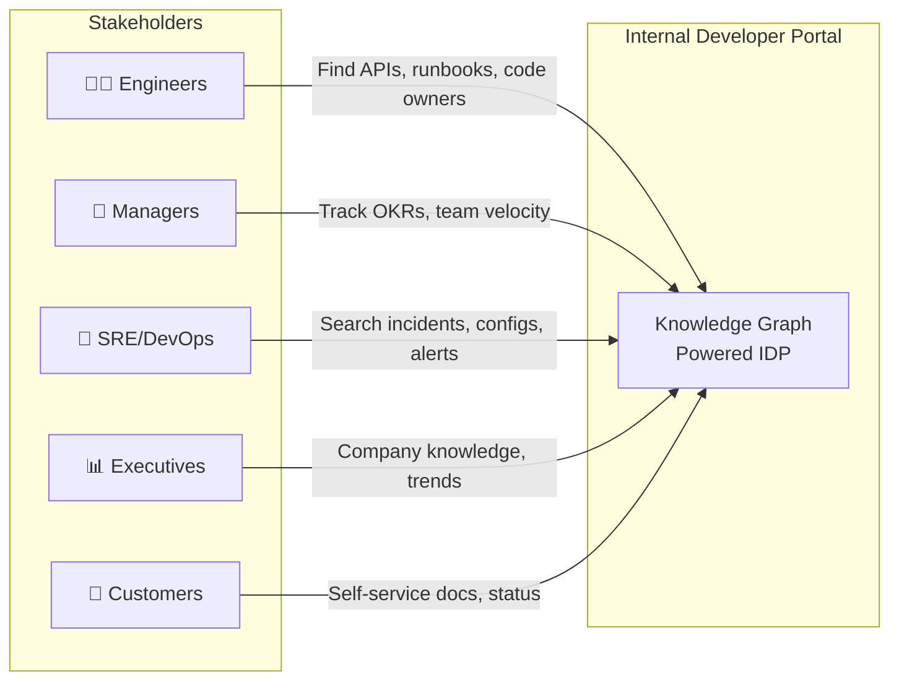

# Week 8 Day 5: AWS Cloud IDP with Glean Knowledge Graph

> **Duration:** 8 hours | **Difficulty:** Advanced  
> **Theme:** Building an AWS-hosted Internal Developer Portal powered by the Glean Knowledge Graph for enterprise productivity.

---

## 🎯 Learning Objectives

By the end of this session, you will:
1. **Understand the Glean Knowledge Graph** — Its core architecture, content integration, people intelligence, activity tracking, and collective intelligence layers.
2. **Design an IDP Platform** — An Internal Developer Portal that gives employees, customers, and stakeholders a single pane of glass for all company knowledge.
3. **Build Custom Connectors** — Push proprietary data (internal wikis, service catalogs, OKRs) into the Knowledge Graph via the Indexing API.
4. **Deploy on AWS** — Terraform-provisioned infrastructure (ECS Fargate, ALB, RDS, S3) hosting the IDP portal.
5. **Implement People Intelligence** — Map organizational context, expertise, and collaboration insights into the search experience.

---

## 📖 Lecture Content

### 1. The Glean Knowledge Graph — Deep Dive

Based on the [official Glean Knowledge Graph documentation](https://docs.glean.com/security/knowledge-graph):

> *"The Glean Knowledge Graph is a powerful tool that forms the backbone of Glean's enterprise search platform, designed to provide users with the most personalized and relevant results."*

The Knowledge Graph has **four pillars**:

```mermaid
graph TD
    KG["Glean Knowledge Graph"]
    
    KG --> CI["Content Integration"]
    KG --> PI["People Intelligence"]
    KG --> AT["Activity Tracking"]
    KG --> CO["Collective Intelligence"]
    
    CI --> CI1["Full content analysis"]
    CI --> CI2["Metadata extraction"]
    CI --> CI3["Permissions management"]
    CI --> CI4["Faceted search"]
    
    PI --> PI1["Unified Identity"]
    PI --> PI2["Organizational Context"]
    PI --> PI3["Collaboration Insights"]
    PI --> PI4["Customizable Profiles"]
    
    AT --> AT1["Teams activity"]
    AT --> AT2["Slack signals"]
    AT --> AT3["Email signals"]
    AT --> AT4["Chrome extension"]
    
    CO --> CO1["Trending content"]
    CO --> CO2["Popular resources"]
    CO --> CO3["Recommended docs"]
```

#### 1.1 Content Integration
- **Full Content Analysis**: Titles, body copy, comments, media — every piece of content is indexed.
- **Metadata Extraction**: Creator, creation time, update history, file type, folder structure.
- **Permissions Management**: ACLs from source systems are respected in search results.
- **Crawl Configuration**: Customizable frequency, blackout periods, multiple crawl methodologies.

#### 1.2 People Intelligence
- **Unified Identity**: A single profile that merges data across Slack, GitHub, Jira, HR systems.
- **Organizational Context**: Team structure, reporting chains, and department mappings.
- **Collaboration Insights**: Who works with whom, based on shared documents and channels.
- **Customizable Profiles**: Engineers can highlight their expertise areas.

#### 1.3 Activity Tracking
Signals from Teams, Slack, Email, Plugins, and Chrome Extension are used to:
- Boost recently viewed content in search rankings.
- Surface trending topics within teams.
- Identify knowledge gaps (what are people searching for but not finding?).

#### 1.4 Collective Intelligence
The aggregated behavior of all users improves relevance:
- Popular documents are boosted organically.
- Frequently accessed runbooks surface automatically during incidents.

### 2. Custom Data Sources for the IDP

Based on the [Glean Custom Connectors documentation](https://docs.glean.com/connectors/custom/about):

Custom connectors push proprietary enterprise data into the Knowledge Graph via the **Indexing API**:

| Use Case | Data Source | Connector Type |
|----------|------------|----------------|
| Service Catalog | Internal CMDB | Custom (Indexing API) |
| Engineering OKRs | Internal OKR tool | Custom (Indexing API) |
| Incident Runbooks | Internal Wiki | Custom (Indexing API) |
| Team Directory | HR System | Custom (Indexing API) |
| API Documentation | Developer Portal | Custom (Indexing API) |

**Deployment Options:**
- **Glean-hosted**: Docker image in Glean's cloud. Secrets in cloud project.
- **Self-hosted (AWS)**: Container in customer's AWS account. Secrets in AWS Secrets Manager.

### 3. The IDP Vision: Who Benefits?

| Stakeholder | IDP Value |
|-------------|-----------|
| **Engineers** | Find API docs, code owners, runbooks in < 5 seconds |
| **Managers** | Track team OKRs, view collaboration patterns |
| **SRE/DevOps** | Search across PagerDuty + Slack + Jira in one query |
| **Executives** | Company-wide knowledge trends and gap analysis |
| **Customers** | Self-service documentation portal with permissioned access |

---

## ✅ Deliverables

- [ ] A Terraform-provisioned AWS environment (ECS Fargate, ALB, RDS, S3).
- [ ] A Knowledge Graph engine with 4 pillars (Content, People, Activity, Collective).
- [ ] Custom connectors pushing Service Catalog, OKRs, and Runbook data.
- [ ] An IDP portal (Flask) that surfaces knowledge with permission-aware search.
- [ ] Mermaid solution architecture diagrams.
- [ ] Complete step-by-step documentation.

---

## 📚 Deep Dive Resources

- 👉 [Solution Architecture Diagrams](docs/diagrams/SOLUTION_ARCHITECTURE.md)
- 👉 [Knowledge Graph Deep Dive Guide](docs/guides/KNOWLEDGE_GRAPH_GUIDE.md)
- 👉 [IDP Use Cases, Outcomes & Goals](docs/guides/IDP_USECASES.md)
- 👉 [Why Glean — The Enterprise IDP Differentiator](docs/guides/GLEAN_VALUE_PROPOSITION.md)
- 👉 [Value Proposition — Hours Saved & Cost Impact](docs/guides/IDP_VALUE_PROPOSITION.md)
- 👉 [Step-by-Step Project Guide](project/README.md)
- 👉 [Reference Links & Resources](resources/RESOURCES.md)

---

  <a href="../day-04-observability/lecture-notes.md">⬅️ Back: Day 4</a> | <strong>Day 5: Knowledge Graph IDP</strong> | <a href="../day-06-presentation/lecture-notes.md">Next: Day 6 ➡️</a>

