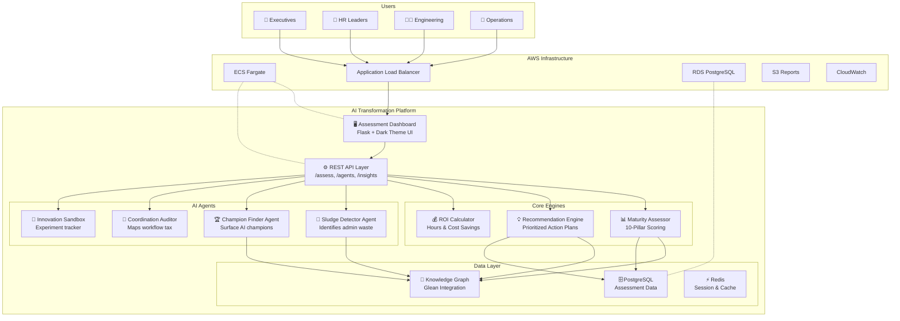
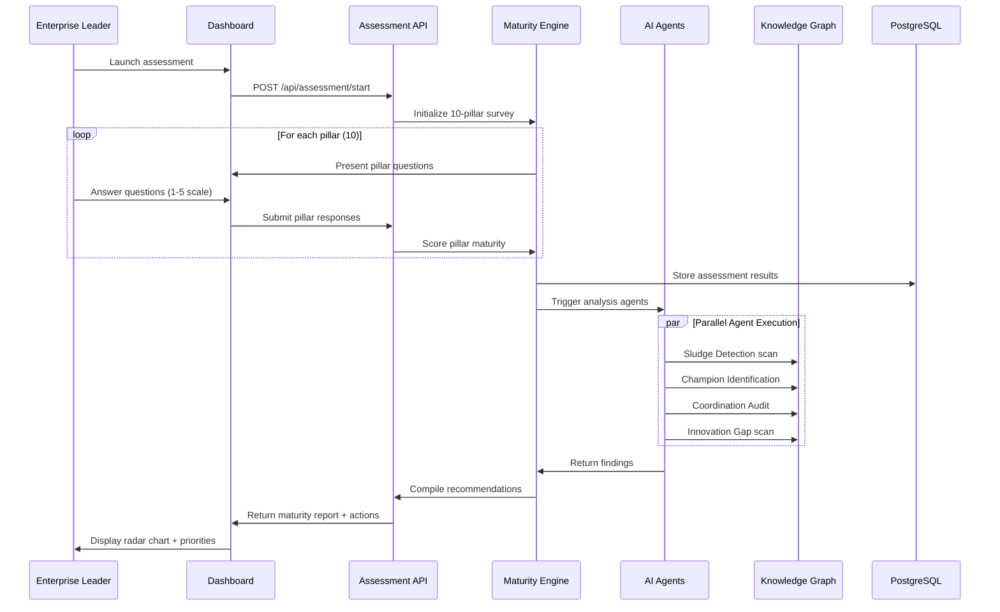
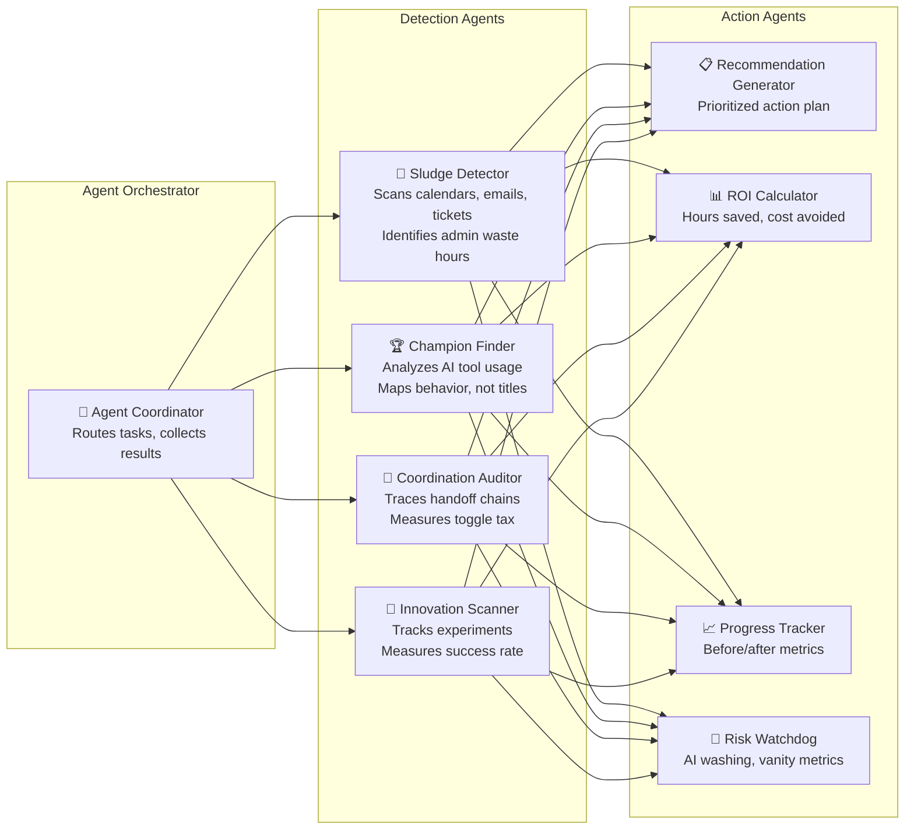
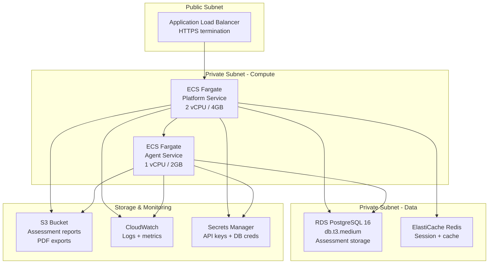
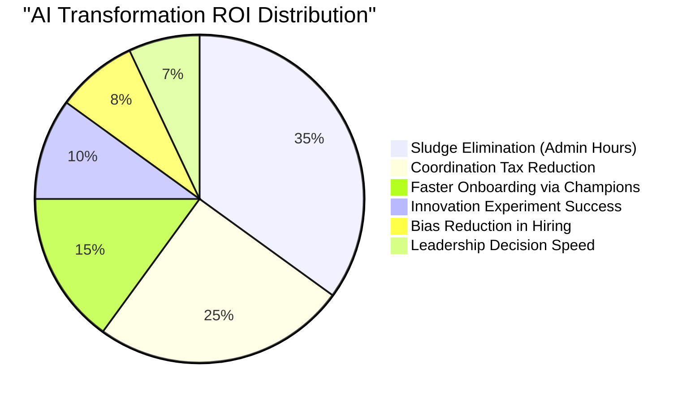

# Solution Architecture: AI Transformation Platform

Enterprise-grade platform architecture for operationalizing the AI Transformation 100 framework.

---

## 1. Platform Architecture Overview

---

## 2. Assessment Data Flow

---

## 3. 10-Pillar Maturity Model Architecture

```mermaid
graph TD
    subgraph "Assessment Framework"
        P1["1️⃣ Division of Labor<br/>Sludge elimination, meeting automation"]
        P2["2️⃣ Expertise<br/>Expert embedding, skill routing"]
        P3["3️⃣ Roles<br/>Champions, drudgery czars, fleet fixers"]
        P4["4️⃣ Control<br/>Governance, policy, hierarchy"]
        P5["5️⃣ Coordination<br/>Silo breaking, super agents"]
        P6["6️⃣ Hiring & Talent<br/>Bias reduction, proven gains"]
        P7["7️⃣ Learning & Dev<br/>Thinking partners, hack-a-thons"]
        P8["8️⃣ Innovation<br/>Sandboxes, VC-style bets"]
        P9["9️⃣ Leadership<br/>J-curve, amplification audit"]
        P10["🔟 Measurement<br/>ROI tracking, vanity metric defense"]
    end

    subgraph "Maturity Levels"
        L1["Level 1: Ad-hoc"]
        L2["Level 2: Opportunistic"]
        L3["Level 3: Systematic"]
        L4["Level 4: Managed"]
        L5["Level 5: Optimizing"]
    end

    P1 & P2 & P3 & P4 & P5 --> L1 & L2 & L3 & L4 & L5
    P6 & P7 & P8 & P9 & P10 --> L1 & L2 & L3 & L4 & L5
```

---

## 4. AI Agent Architecture

---

## 5. AWS Deployment Architecture

---

## 6. Value Metrics Dashboard

---

  <a href="../../lecture-notes.md">⬅️ Back: Lecture Notes</a> | <a href="../guides/IMPLEMENTATION_WORKFLOW.md">Next: Implementation Workflow ➡️</a>

