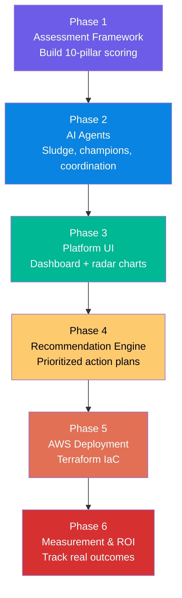

# Implementation Workflow: AI Transformation Platform

A detailed, step-by-step workflow for building and deploying the AI Transformation Platform based on the Glean AI Transformation 100 report.

---

## 🗺️ End-to-End Workflow



---

## Phase 1: Build the 10-Pillar Assessment Framework

### 1.1 Define the Maturity Model

Each of the 10 pillars is assessed across 5 maturity levels:

| Level | Name | Description | Score |
|-------|------|-------------|-------|
| 1 | **Ad-hoc** | No formal AI processes; scattered individual experiments | 1 |
| 2 | **Opportunistic** | Team-level pilots; some awareness of AI potential | 2 |
| 3 | **Systematic** | Cross-functional programs; formal AI roles and policies | 3 |
| 4 | **Managed** | Governed, measured, scaled AI deployments; ROI tracking | 4 |
| 5 | **Optimizing** | Self-improving AI ecosystem; continuous experimentation | 5 |

### 1.2 Design Assessment Questions (3 per pillar)

**Pillar 1 — Division of Labor:**
1. "What percentage of employee time is spent on administrative tasks that could be automated?"
2. "Do you use AI to extract action items from meetings and compile status updates?"
3. "Have employees nominated their most joyless, soul-draining tasks for AI automation?"

**Pillar 2 — Expertise:**
1. "Do you embed AI-savvy experts in business units, or keep them centralized?"
2. "When AI generates options, do domain experts make the final decision?"
3. "Are generalists empowered to prototype AI solutions before calling in specialists?"

**Pillar 3 — Roles:**
1. "Have you appointed AI drudgery czars to identify automation opportunities?"
2. "Do you have peer-to-peer AI champions who spread adoption laterally?"
3. "Are you experimenting with merging specialized roles to reduce handoffs?"

**Pillar 4 — Control:**
1. "Do your leaders actively use AI tools before setting AI policies?"
2. "Do you have nuanced, regularly updated AI governance policies?"
3. "Is AI leadership represented at the C-suite level?"

**Pillar 5 — Coordination & Silos:**
1. "Have you mapped how work really gets done before deploying AI?"
2. "Do you use super agents instead of disconnected AI copilots?"
3. "Do you measure AI's hidden coordination costs, not just its output?"

**Pillar 6 — Hiring & Talent:**
1. "Do you wait for demonstrated AI productivity gains before making headcount changes?"
2. "Do you use AI to audit and reduce bias in hiring, reviews, and promotions?"
3. "Do employees have at least one AI growth goal in their performance objectives?"

**Pillar 7 — Learning & Development:**
1. "Do you use AI as a thinking partner rather than a substitute for thinking?"
2. "Do you run hack-a-thons, agent-a-thons, or prompt-a-thons?"
3. "Do junior employees mentor seniors on AI tools?"

**Pillar 8 — Innovation:**
1. "Do you have an AI sandbox for safe experimentation?"
2. "Is there a mandatory review asking 'Does this really need AI?' for new projects?"
3. "Do you plan for the majority of AI experiments to fail (VC-style bets)?"

**Pillar 9 — Leadership:**
1. "Do leaders demo AI tools in staff meetings and show real usage?"
2. "Is AI a standing agenda item in executive forums?"
3. "Have you run an 'amplification audit' — asking what AI will magnify?"

**Pillar 10 — Measurement:**
1. "Is every AI claim tied to a specific, measurable outcome?"
2. "Do you guard against vanity metrics and 'AI theater'?"
3. "Are metrics in the hands of teams, not just management?"

### 1.3 Build the Scoring Engine

```python
# Scoring formula
pillar_score = mean(question_scores)  # 1-5 per question
overall_maturity = mean(all_pillar_scores)

# Maturity classification
if overall_maturity >= 4.5: level = "Optimizing"
elif overall_maturity >= 3.5: level = "Managed"
elif overall_maturity >= 2.5: level = "Systematic"
elif overall_maturity >= 1.5: level = "Opportunistic"
else: level = "Ad-hoc"
```

---

## Phase 2: Build AI Agents

### 2.1 Sludge Detector Agent

**Purpose:** Identify the highest-impact administrative sludge targets.

**Workflow:**
1. Collect employee nominations (Slack/form: "What's the most joyless part of your day?")
2. AI clusters nominations by category (scheduling, reporting, approvals, data entry)
3. Score each cluster: `impact = frequency × time_per_task × employee_sentiment`
4. Rank clusters and recommend top 5 automation targets

### 2.2 Champion Finder Agent

**Purpose:** Identify AI champions through behavior, not titles.

**Workflow:**
1. Scan AI tool usage logs (who uses AI 5+ times/week?)
2. Track who shares AI tips in Slack/Teams
3. Identify who submitted ideas in prompt-a-thons AND implemented them after
4. Score: `champion_score = usage_freq × sharing_ratio × implementation_rate`
5. Map champions per business unit for lateral adoption coverage

### 2.3 Coordination Auditor Agent

**Purpose:** Map and measure the "toggle tax" and handoff friction.

**Workflow:**
1. Trace document handoff chains across tools (Confluence → Slack → Jira → Email)
2. Measure time between handoffs (handoff latency)
3. Count tool switches per task (toggle tax)
4. Identify bottleneck approvers (who stalls the most workflows?)
5. Recommend super-agent consolidation points

### 2.4 Innovation Scanner Agent

**Purpose:** Track AI experiment success rates and prevent "AI theater."

**Workflow:**
1. Catalog all AI pilots and experiments
2. Track phase: `ideation → prototype → pilot → production → retired`
3. Apply the 5-Part AI Washing Gut Check to vendor proposals
4. Measure: experimentation rate, success rate, time-to-production, actual ROI
5. Flag vanity metrics (e.g., "10x improvement" without baseline)

---

## Phase 3: Build the Platform UI

### 3.1 Dashboard Layout

```
┌──────────────────────────────────────────────────────┐
│  🧠 AI Transformation Platform                       │
│  ┌─────────┐ ┌─────────┐ ┌─────────┐ ┌─────────┐   │
│  │ Maturity │ │ Sludge  │ │Champions│ │   ROI   │   │
│  │  Score   │ │Detected │ │ Found   │ │ Saved   │   │
│  │  3.2/5   │ │  847hrs │ │   23    │ │ $1.2M   │   │
│  └─────────┘ └─────────┘ └─────────┘ └─────────┘   │
│                                                      │
│  ┌──────────────────────┐ ┌────────────────────────┐ │
│  │   RADAR CHART        │ │  TOP 5 RECOMMENDATIONS │ │
│  │   (10 Pillars)       │ │  1. Automate meeting   │ │
│  │                      │ │     action items       │ │
│  │   Division of Labor  │ │  2. Deploy super agent │ │
│  │      ████████ 4.2    │ │  3. Appoint drudgery   │ │
│  │   Expertise          │ │     czar in Marketing  │ │
│  │      ██████ 3.0      │ │  4. Run amplification  │ │
│  │   Roles              │ │     audit              │ │
│  │      ████ 2.0        │ │  5. Build AI sandbox   │ │
│  │   ...                │ │                        │ │
│  └──────────────────────┘ └────────────────────────┘ │
└──────────────────────────────────────────────────────┘
```

### 3.2 Key UI Components

- **Maturity Radar Chart**: 10-axis radar showing pillar scores (1-5)
- **Sludge Heatmap**: Hours lost by department and task category
- **Champion Network**: Graph visualization of AI champions per business unit
- **ROI Dashboard**: Projected vs. actual savings, J-curve visualization
- **Action Plan Timeline**: Gantt chart of recommended actions

---

## Phase 4: Recommendation Engine

### 4.1 Priority Scoring Algorithm

```python
# Each recommendation is scored by:
priority = (
    impact_score * 0.4 +        # How much time/money saved
    feasibility_score * 0.3 +    # How easy to implement
    quick_win_score * 0.2 +      # Can we see results in < 30 days?
    strategic_alignment * 0.1    # Does it match company goals?
)
```

### 4.2 Recommendation Categories

| Priority | Category | Example Action | Timeline |
|----------|----------|---------------|----------|
| 🔴 Critical | Quick Wins | Deploy meeting action summary agent | 1 week |
| 🟠 High | Structural | Appoint AI drudgery czars per function | 2-4 weeks |
| 🟡 Medium | Cultural | Run company-wide prompt-a-thon | 1-2 months |
| 🟢 Strategic | Organizational | Merge specialized roles, reduce handoffs | 3-6 months |
| 🔵 Foundational | Governance | Build AI governance framework with nuanced policies | 1-3 months |

---

## Phase 5: Deploy to AWS

### 5.1 Terraform Deployment

```bash
cd project/src/terraform
terraform init
terraform plan
terraform apply -auto-approve
```

### 5.2 Infrastructure Components

| Component | AWS Service | Purpose |
|-----------|------------|---------|
| Compute | ECS Fargate | Serverless platform hosting |
| Database | RDS PostgreSQL 16 | Assessment data storage |
| Load Balancer | ALB | HTTPS endpoint |
| Reports | S3 | PDF report storage |
| Secrets | Secrets Manager | API keys, DB credentials |
| Monitoring | CloudWatch | Logs and metrics |

---

## Phase 6: Measurement & ROI

### 6.1 Anti-Vanity Metric Framework

Based on the report's warnings about "AI theater":

| ❌ Vanity Metric | ✅ Real Metric |
|------------------|---------------|
| "We deployed 50 AI tools" | "43% of employees use AI weekly" |
| "Our AI generates 10x content" | "Support ticket resolution 28% faster" |
| "100% of teams have AI access" | "Average admin sludge reduced from 4.2h to 1.8h/day" |
| "We saved $10M" (projected) | "Verified $2.4M savings via time-tracking audits" |

### 6.2 ROI Tracking Dashboard

For each pillar, track **before** and **after** metrics:

| Pillar | Before Metric | After Metric | Target |
|--------|--------------|-------------|--------|
| Division of Labor | Hours/week on admin tasks | Hours/week on admin tasks | -50% |
| Coordination | Tool switches per task | Tool switches per task | -60% |
| Hiring | Time-to-hire (days) | Time-to-hire (days) | -30% |
| Learning | Time to new hire productivity | Time to new hire productivity | -40% |
| Innovation | Experiment → production rate | Experiment → production rate | +25% |

---

<p align="center">
  <a href="../diagrams/SOLUTION_ARCHITECTURE.md">⬅️ Back: Architecture</a> | <a href="../../project/README.md">Next: Project Guide ➡️</a>
</p>
