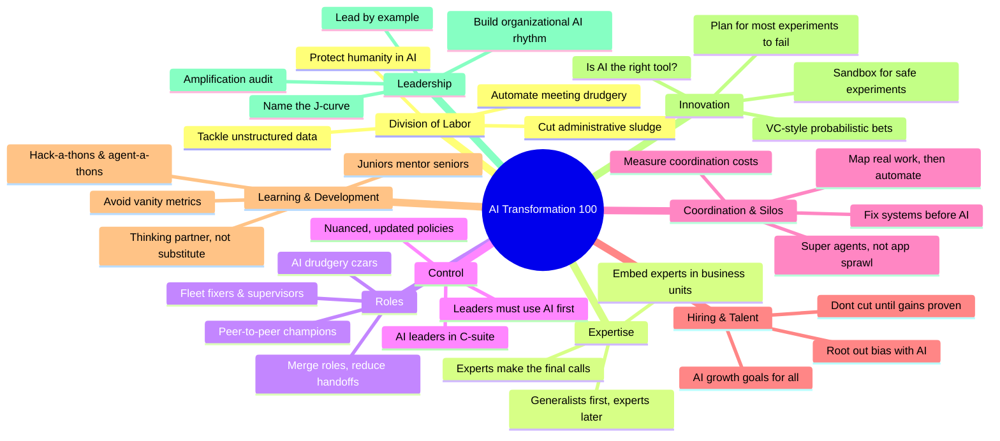
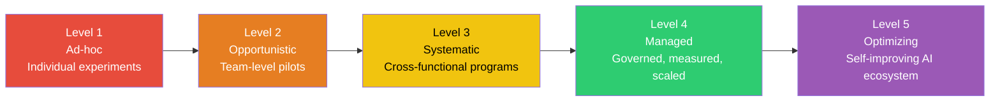

# Week 8 Day 6: Enterprise AI Transformation Platform

> **Duration:** 8 hours | **Difficulty:** Advanced
> **Theme:** Implementing the Glean Work AI Institute's "AI Transformation 100" framework as a platform-driven enterprise solution.

---

## 📖 Source Material

This day's content is derived from the **Glean Work AI Institute** report:
> **[AI Transformation 100: How AI Is Changing Work](https://www.glean.com/work-ai-institute/ai-transformation-100)**
> *Based on insights from 100+ leaders across business, academia, and tech, this report reveals how AI is redefining leadership and collaboration.*

---

## 🎯 Learning Objectives

By the end of this session, you will:
1. **Understand the 10 Pillars of AI Transformation** — Division of Labor, Expertise, Roles, Control, Coordination, Hiring, Learning, Innovation, Leadership — and how they interconnect.
2. **Design an AI Transformation Assessment Platform** — A platform that scores enterprise maturity across all 10 pillars and generates actionable recommendations.
3. **Build AI Agents for Transformation** — Automated agents for sludge detection, champion identification, coordination tax calculation, and innovation sandboxing.
4. **Deploy on AWS** — Terraform-provisioned infrastructure for hosting the transformation platform.
5. **Measure Real ROI** — Data-driven frameworks to avoid vanity metrics and "AI theater."

---

## 📖 The AI Transformation 100 — Key Insights

### The 10 Pillars of Enterprise AI Transformation

The report organizes 100 actionable ideas across **10 interconnected pillars**:

### Five Big Lessons from the Report

| # | Lesson | Core Idea |
|---|--------|-----------|
| 1 | **Start with sludge** | 53% of knowledge worker time is lost to administrative sand traps — scheduling, status updates, chasing decisions. AI's first job is eliminating this drudgery. |
| 2 | **Don't let hype drive headcount cuts** | 80% of AI pilot initiatives don't achieve imagined productivity gains. Don't cut jobs until gains are **demonstrated**, not projected. |
| 3 | **Fix the system, not just the tech** | Bolting AI onto broken legacy processes amplifies coordination failures. Map how work **really** gets done before automating. |
| 4 | **Champions emerge through action** | The best AI champions aren't nominated — they surface through prompt-a-thons, hack-a-thons, and agent-a-thons. Watch behavior, not titles. |
| 5 | **Leaders must use AI themselves** | When managers use AI 5+ times per week, team adoption jumps to 75%. Lead by example or delegate authority to those who do. |

### The Enterprise Transformation Maturity Curve

---

## 🔑 Key Concepts from the Report

### 1. Administrative Sludge

> *"A 2024 survey of 13,000+ knowledge workers found 53% of their time disappeared into administrative sand traps."* — Asana State of Work Innovation Report

**What it is:** Scheduling meetings, writing status updates, chasing approvals, copy-pasting data between tools, compiling briefing decks.

**AI solution:** Use AI to cluster employee-nominated "sludge" tasks, spot quick wins, and rank-order automation targets. Glean's Daily Meeting Action Summary agent extracts action items from every meeting into a Slack digest.

### 2. Unstructured Data as the Root Cause

> *"90% of the data generated by companies is unstructured."* — IDC Report / Box CEO Aaron Levie

**What it is:** Emails, PDFs, call transcripts, wikis, chats, support tickets, CRM notes trapped in disconnected silos.

**AI solution:** Use a Knowledge Graph (like Glean) to unify unstructured data into a searchable, permission-aware intelligence layer. Replace briefing decks with AI-compiled briefs from Slack, project plans, and tickets.

### 3. Super Agents vs. Tool Sprawl

> *"Workers are drowning in apps, dashboards, and digital tools, leading to 'digital exhaustion.'"* — Prof. Paul Leonardi, UC Santa Barbara

**What it is:** A growing list of disconnected AI copilots, each with its own login, quirks, and learning curve.

**AI solution:** Build a **super agent** — a single front door to many smaller AI agents. One platform that knows who you are, what you do, and what information matters most.

### 4. The AI Flattery Trap & Vanity Metrics

The report warns against "AI theater" — impressive demos that don't translate to real-world value. Every AI claim should tie to something specific you can measure: fewer bugs, faster cycles, higher accuracy.

**5-Part AI Washing Gut Check:**
1. **Outlandish Promises Test** — Can they show working AI today?
2. **AI Residue Test** — Remove "AI" from the pitch. Does it still impress?
3. **Reference Ghosting Test** — Can they produce happy current customers?
4. **Human-in-the-Loop Test** — Does it enhance judgment or replace it?
5. **Missing Metric Test** — Tied to specific measurable outcomes?

### 5. The J-Curve of AI Adoption

Leaders should "name the J-curve" — acknowledge that AI transformation dips before it climbs. Early adoption will be messy, slow, and sometimes worse than the old way. That's normal. Teams that push through the dip reach exponential gains.

---

## ✅ Deliverables

- [ ] An AI Transformation Maturity Assessment platform (Python/Flask)
- [ ] AI Agents for sludge detection, champion identification, and coordination audit
- [ ] Mermaid solution architecture diagrams (6)
- [ ] Terraform-provisioned AWS infrastructure
- [ ] Complete step-by-step documentation
- [ ] Value proposition and ROI framework

---

## 📚 Deep Dive Resources

- 👉 [Solution Architecture Diagrams](docs/diagrams/SOLUTION_ARCHITECTURE.md)
- 👉 [Detailed Workflow Implementation Guide](docs/guides/IMPLEMENTATION_WORKFLOW.md)
- 👉 [Administrative Sludge Detection Guide](docs/guides/SLUDGE_DETECTION_GUIDE.md)
- 👉 [AI Champion Program Guide](docs/guides/CHAMPION_PROGRAM_GUIDE.md)
- 👉 [AI Washing Defense Guide](docs/guides/AI_WASHING_GUIDE.md)
- 👉 [Enterprise Use Cases & ROI](docs/guides/USE_CASES.md)
- 👉 [Step-by-Step Project Guide](project/README.md)
- 👉 [Reference Links & Resources](resources/RESOURCES.md)

---

  <a href="../day-05-knowledge-graph-idp/lecture-notes.md">⬅️ Back: Day 5</a> | <strong>Day 6: AI Transformation Platform</strong> | <a href="../../README.md">Finish Bootcamp 🏁</a>

