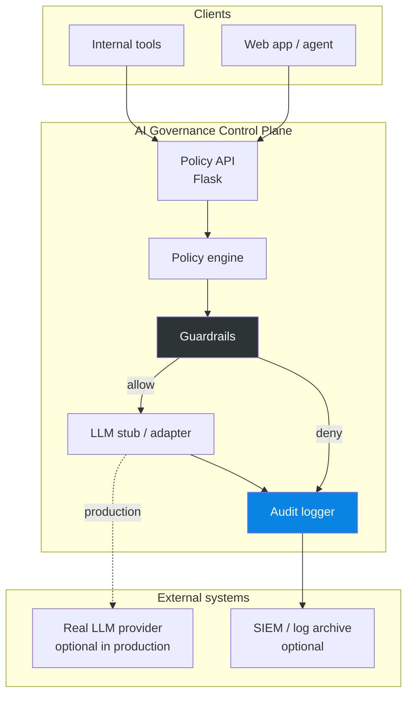
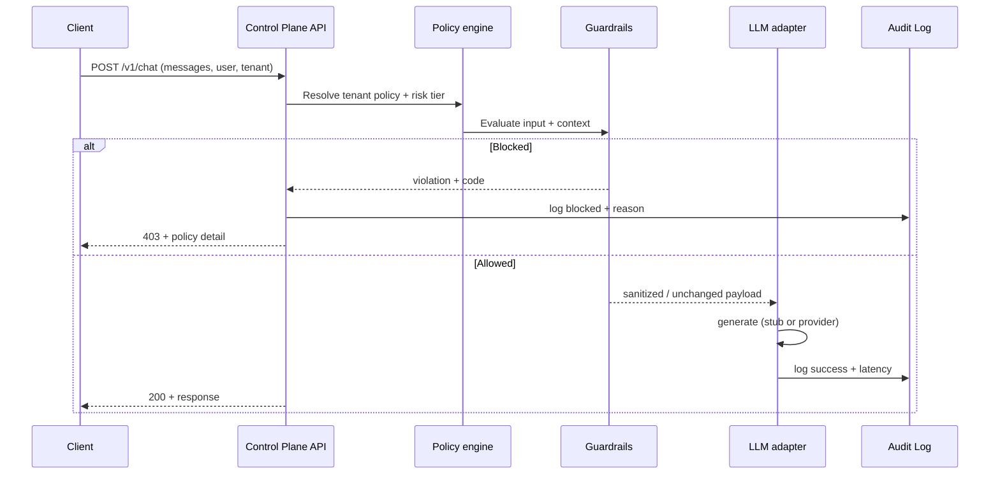
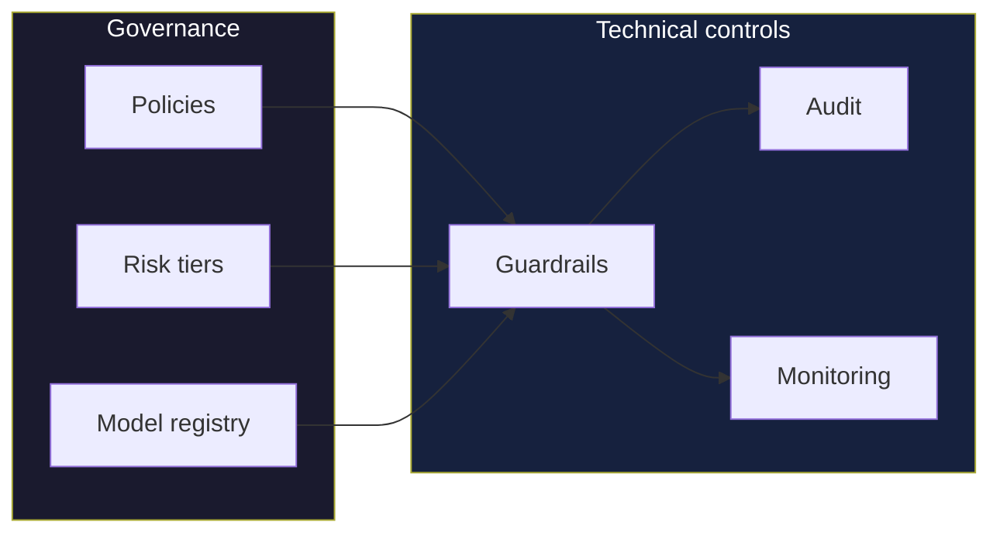

# Capstone: AI Governance Control Plane — Solution Architecture

> Reference architecture for the Day 7 project: a **policy-enforcing gateway** in front of LLM calls, with **audit** and **guardrails**.

---

## 1. Context diagram

---

## 2. Request flow (sequence)

---

## 3. Governance operating model (people + process)

---

## 4. Deployment options

| Pattern | When to use |
|---------|-------------|
| **Sidecar / gateway** | Single entry for all LLM traffic (recommended for enforcement) |
| **SDK wrapper** | Fast adoption; weaker guarantee if bypassed |
| **Proxy** | Centralized routing + rate limits + policy |

The capstone implements a **gateway-style** API so enforcement is explicit and testable.

---

## 5. Extension points (for your portfolio)

- **OIDC / JWT** for user identity and tenant claims.
- **OPA** or **Open Policy Agent** for complex policy rules.
- **Async queue** for human approval on T3 actions.
- **Export audit logs** to SIEM (Splunk, Datadog, CloudWatch).

---

  <a href="../GOVERNANCE_FRAMEWORK.md">← Governance framework</a> | <a href="../../project/README.md">Run the project →</a>

