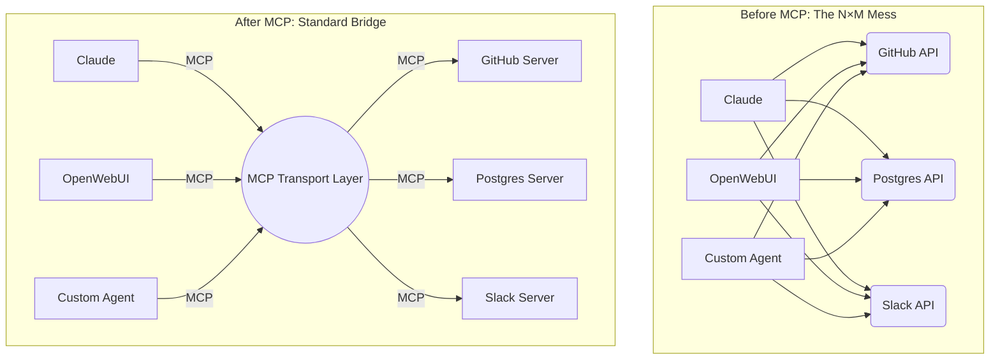
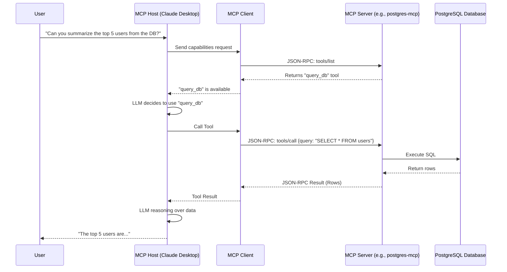
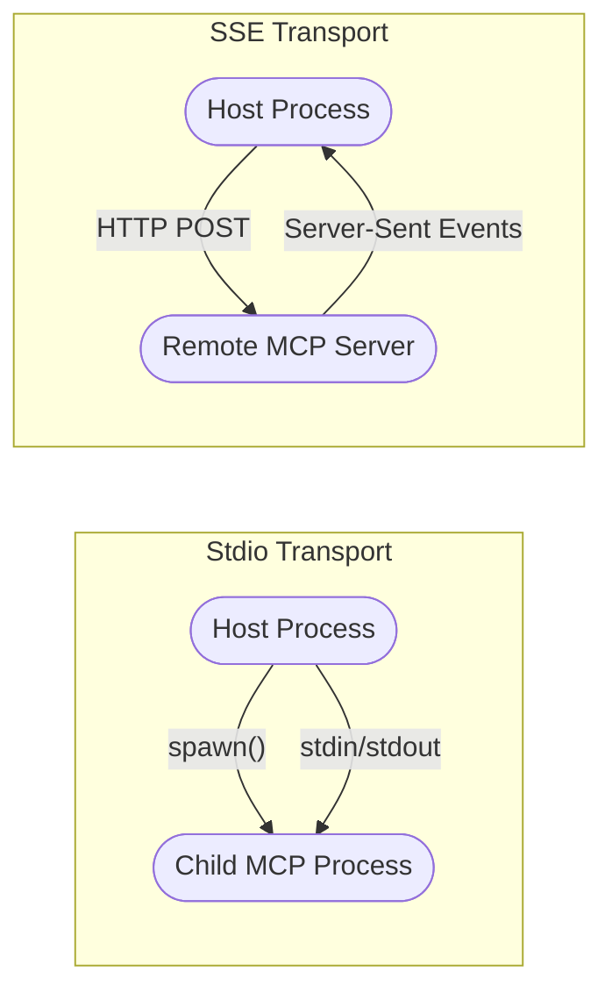
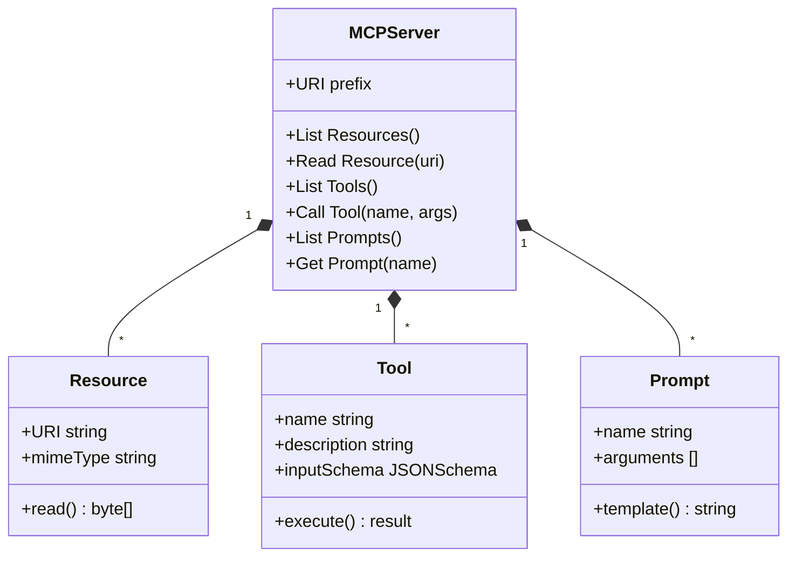

# 01. MCP Architecture and Core Concepts

The Model Context Protocol (MCP) radically alters how AI infrastructure is built. In this deep dive, we explore its architecture, its protocol design, and the exact primitives it uses to function.

## 🧭 The Core Problem: N×M Complexity

Historically, integrating AIs with data meant that for `N` AI applications (Claude, ChatGPT, LangChain) and `M` Data Sources (Github, Postgres, Google Drive), you needed `N * M` custom API integrations. 

MCP introduces a **Standardized Glue Layer**, reducing complexity from `N * M` to `N + M`. Data providers build one MCP server, and any MCP-compliant AI application can immediately connect to it.

---

## 🏗️ The 3-Tier Architecture

MCP relies on a strictly defined Client-Server topology. 

1. **The MCP Host**: The environment where the LLM runs (e.g., Claude Desktop, VSCode, an autonomous agent framework).
2. **The MCP Client**: A component *inside* the Host that establishes and maintains a standardized JSON-RPC connection.
3. **The MCP Server**: A lightweight executable or web service that exposes local data, specific APIs, or tools.

---

## 🔌 The Transport Layer (JSON-RPC)

Under the hood, all MCP communication relies on standard **JSON-RPC 2.0**. However, the *method* of transport varies based on the environment.

### 1. STDIO (Standard Input/Output)
- **Use Case**: Best for local tools and IDE environments.
- **How it works**: The Host launches the Server as a completely separate child process on the local machine. They communicate highly efficiently via `stdin` and `stdout`.
- **Security Check**: Extremely secure. The server runs as a local process with exact user permissions. No open ports required.

### 2. SSE (Server-Sent Events) over HTTP
- **Use Case**: Remote endpoints, Enterprise SaaS, or distributed agent architectures.
- **How it works**: The Client connects to a remote Server via HTTP using SSE. The client POSTs JSON-RPC messages, and the Server streams responses back as events.

---

## 🧱 The 3 Protocol Primitives

An MCP Server exposes its functionality to the LLM Host using three very specific primitives. Think of these as the fundamental verbs the LLM is allowed to use.

### 1. Resources (Read-Only Data Context)
Resources allow the Server to expose structured data or files directly to the Host. 
- **Trigger**: The LLM needs context before generating a response.
- **Example**: `file:///local/path/to/logs.txt` or `postgres://schema/tables/users`
- **When to use**: Giving the LLM immediate access to a codebase or a database schema.

### 2. Tools (Executable Actions)
Tools are functions exposed by the Server that the Host can request the LLM to execute. This is what enables "Agentic" behavior.
- **Trigger**: The LLM needs to *do* something.
- **Example**: `execute_sql_query(query: string)`, `github_create_issue(title: string)`
- **Safety**: Execution is strictly controlled. The Host always prompts the User for consent before allowing the Tool to fire (in standard configurations).

### 3. Prompts (Standardized Templates)
Prompts are pre-configured strings stored on the Server. They help standardize how users interact with complex server data.
- **Trigger**: A user wants a quick, optimized interaction path without typing out a long prompt.
- **Example**: `debug_error(stack_trace: string)` -> Prompts the LLM to analyze the provided stack trace using specific organizational coding standards stored on the server.

---

> [!TIP]
> **Why this matters for AIOps:**
> By utilizing MCP, an AIOps dashboard doesn't need to write hardcoded integrations for Pagerduty, Datadog, Slack, and Kubernetes. The AIOps system simply acts as an *MCP Host*, dynamically loading context and executing remediation tools through standard MCP protocols.
