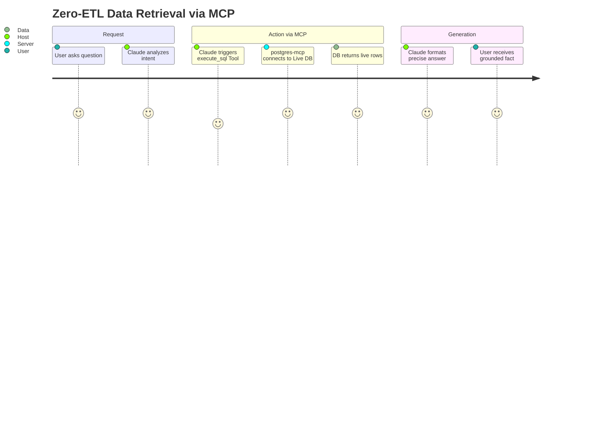
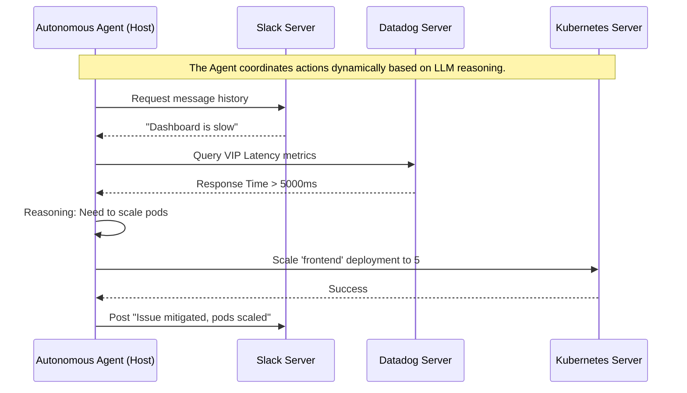

# 02. MCP Enterprise Use Cases

Because MCP standardizes context retrieval and tool execution, it unlocks profound capabilities for enterprises. Instead of building narrow, single-purpose chatbots, LLMs become central cognitive engines connected to all organizational scaffolding.

Here are the primary use cases for MCP in modern enterprise architecture.

---

## 1. Zero-ETL Data Integration & Retrieval (RAG without the DB)

**The Problem:** Traditional RAG (Retrieval-Augmented Generation) requires massive data pipelines. You must extract data from Postgres, chunk it, embed it, and store it in a Vector DB just so the LLM can read it. When data updates in Postgres, your Vector DB is instantly stale.

**The MCP Solution:** MCP allows the LLM to query the live system *directly* as a Tool or Resource. 

**Workflow:**
1. User asks: "What were the total sales for Q3?"
2. System (Host) evaluates user query.
3. Host triggers MCP Postgres Server tool: `execute_sql(query="SELECT sum(amount) FROM sales WHERE quarter='Q3'")`
4. Server runs SQL against live DB, passes exact row data back to the LLM.
5. LLM generates natural language response based on the guaranteed-fresh data.



**Why it matters:** Zero hallucinations caused by stale vector caches. Massive reduction in engineering hours spent maintaining ETL pipelines.

---

## 2. Advanced IDE Integration & Software Development

**The Problem:** Coding assistants (like GitHub Copilot) sit in your IDE but often lack profound context about the broader environment (server logs, external APIs, Kubernetes cluster state).

**The MCP Solution:** Connect the IDE (Host) to local systems via Stdio MCP Servers.

**Workflow:**
- **File System MCP:** Allows the LLM to autonomously navigate, read, and rewrite files anywhere on the disk.
- **Git MCP:** Allows the LLM to run `git log`, read diffs, and create branches for you.
- **Terminal/Bash MCP:** Allows the LLM to execute `npm build` or `pytest`, read the stdout/stderr, and *fix its own code* based on test failures.

```mermaid
graph TD
    IDE[VSCode / Cursor (MCP Host)]
    
    subgraph Stdio Local Processes
        GIT[Git Server]
        FS[File System Server]
        BASH[Terminal/CLI Server]
    end
    
    IDE --> |JSON-RPC| GIT
    IDE --> |JSON-RPC| FS
    IDE --> |JSON-RPC| BASH
    
    GIT -.-> |Reads Git metadata| G(Local .git)
    FS -.-> |Writes code| D(Local Files)
    BASH -.-> |Runs compilers| T(Local Shell)
```

**Why it matters:** LLMs transition from "autocomplete chatbots" to "autonomous junior developers" that can verify their own work before presenting it.

---

## 3. Cross-Domain Agentic Workflows

**The Problem:** Automating cross-domain tasks (e.g., getting a customer alert in Zendesk, checking Datadog, applying a Kubernetes fix, and replying in Slack) requires expensive platforms like Zapier and rigid rule sets.

**The MCP Solution:** By connecting multiple MCP servers to a single agent engine, the LLM can dynamically orchestrate actions across completely isolated domains without a rigid script.

**Workflow:**
1. **Trigger**: Slack message arrives from VIP customer stating "The dashboard is slow."
2. **Retrieve Context (Tool 1)**: LLM calls `slack-mcp` to read the threaded error logs.
3. **Analyze Metrics (Tool 2)**: LLM calls `datadog-mcp` to query latency on the VIP tenant ID.
4. **Take Action (Tool 3)**: LLM determines CPU throttling is occurring. Calls `kubernetes-mcp` to scale the deployment.
5. **Resolve (Tool 1)**: LLM calls `slack-mcp` to reply to the user that the issue is mitigated.



**Why it matters:** AI becomes a universal glue layer for operational tooling, replacing hardcoded integration scripts with intelligent, adaptable reasoning.

---

> [!WARNING]
> **Security Implication (Human in the Loop)**
> Because MCP allows LLMs to take destructive actions (like dropping scaling pods), enterprise deployments must utilize the **Prompt-and-Approve** pattern. The MCP Host must intercept dangerous Tool calls and force a Human user to click "Approve Execution" before the JSON-RPC request is actually emitted to the Server.
